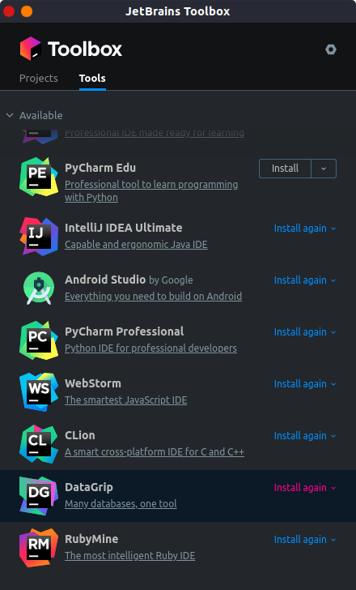
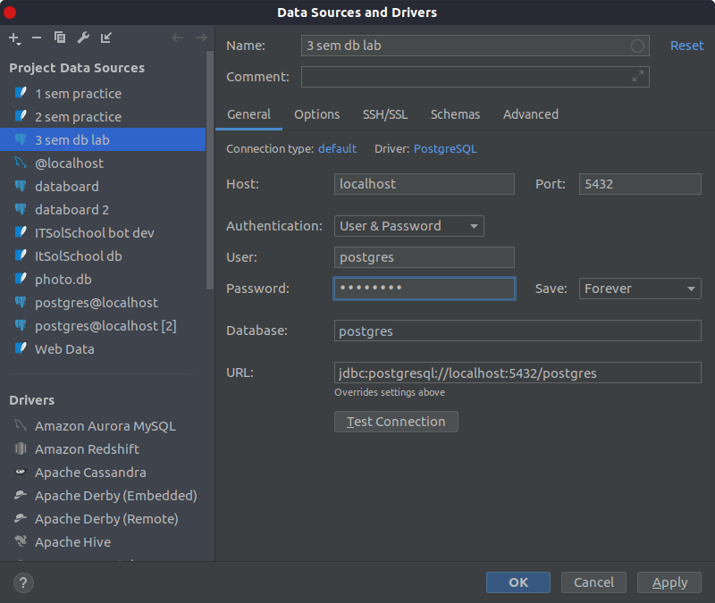
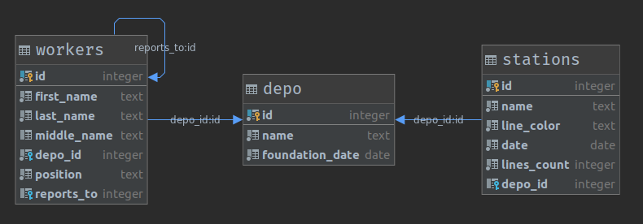
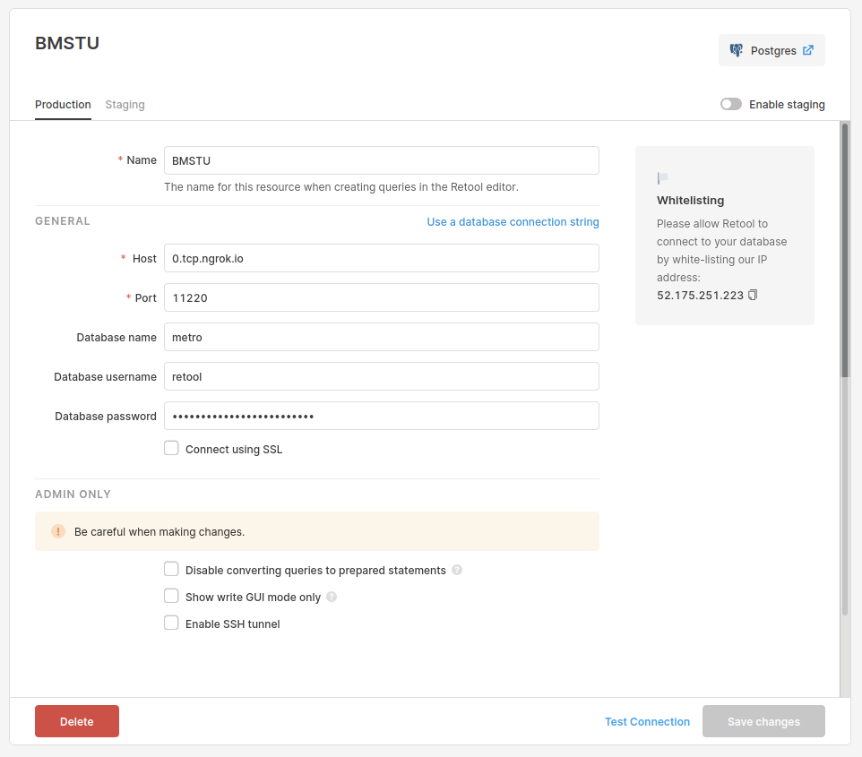

= Установка комплекса программ для разработки баз данных
:lab: 1
:discipline: Базы данных

== Предисловие
Из-за отсутствия установочных файлов Oracle XE для дистрибутивов linux ориентированных на debian
был выбран следующий набор инструментов:

- https://www.postgresql.org/[PostgreSQL] -- СУБД с поддержкой индексов, нескольких баз данных, системы доступа, sequences.
В рамках лабораторных работ покрывает функционал Oracle, за исключением преднастроенных учебных данных.
- https://www.jetbrains.com/datagrip/[JetBrains DataGrip] -- клиент для графического доступа к СУБД, дающий возможность отобразить схему БД в виде диаграммы.
Предоставляет функционал аналогичный Oracle SQL Developer, за исключением графического создания схем.
- https://retool.com[Retool] -- online-инструмент для прототипирования графических интерфейсов, имеющий возможность взаимодействия с БД.
Аналогичен Oracle Application Express.
- https://ngrok.com[Ngrok] -- динамический прокси сервер. Будет использоваться в 3 лабораторной работе для соединения Retool с локальной БД.
- https://www.docker.com/[Docker] -- система контейнеризации и дистрибьюции приложений. Используется для установки PostgreSQL

Набор инструментов обладает функционалом для выполнения заданий из всех 3 лабораторных работ, но не имеет методических указаний.

== Установка
=== PostgreSQL

Для установки используется следующая команда:

[source,shell script]
----
docker run --name postgres-bmstu <1>
  -v $(pwd)/pg:/var/lib/postgresql/data <2>
  -e POSTGRES_PASSWORD=password <3>
  -p 5432:5432 <4>
  postgres:12 <5>
----

<1> -- запускается контейнер с именем `postgres-bmstu`;
<2> -- файлы с данными СУБД будут хранится в дериктории `./pg`;
<3> -- через переменную окружения задаётся пароль пользователя `postgres` (аналогичен пользователю ROOT);
<4> -- порт `5432`, открытый внутри контейнера становится доступным по адресу `localhost:5432` вне контейнера;
<5> -- используется образ postgres последней 12-ой версии.

Запуск и остановка контейнера соответственно производится следующими командами:
[source,shell script]
----
docker start postgres-bmstu
docker stop postgres-bmstu
----

=== DataGrip
Для установки DataGrip испольузется менеджер установщик программ https://www.jetbrains.com/toolbox-app/[JetBrains Toolbox]

image::toolbox.png[]

== Запуск. Доступ к БД
Для запуска PostgreSQL используем команду:
[source,shell script]
docker start postgres-bmstu

В DataGrip добавляем новый источник данных, указываем в настройках хоста `localhost:5432` и в настройках пользователя `postgres:password`:

== Создание тестовой БД
Для проверки работоспособности установленной СУБД создаётся БД под названием metro и заполняется 3 табличками: рабочие, депо, станции.

Создаётся всё это с помощью следующего скрипта:
[source,sql]
----
CREATE DATABASE metro;

include::pgsql/postgres_public_depo.sql[]

include::pgsql/postgres_public_stations.sql[]

include::pgsql/postgres_public_workers.sql[]
----

С помощью DataGrip можно построить схему полоученной БД:

== Простейшее администрирование
Для задачи администрирования создаётся пользователь `retool` для доступа к СУБД программы Retool.

Для этого надо выполнить следующий код:
[source,sql]
----
create user retool with password 'retool-Pass';

grant select on all tables in schema public to retool;
----

Команда создаёт пользователя retool с паролем и даёт ему права на получение данных из всех несистемных таблиц в бд.

== Получение доступа к БД из Retool
Для доступа к СУБД надо запустить ngrok:
[source,shell script]
ngrok tcp 5432

Команда выдаёт внешний хост и порт `tcp://0.tcp.ngrok.io:11220`.

В Retool во вкладке "Resources" создаём новый PostgreSQL:

== Контрольные вопросы

[.warn]
*TODO*
