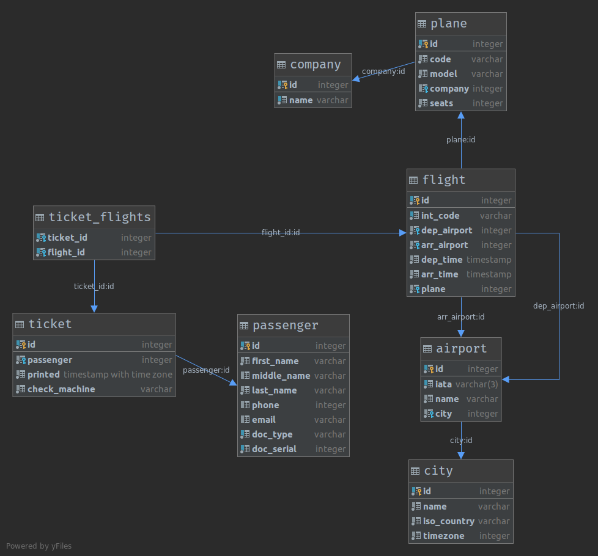

= Создание и заполнение БД
:lab: 2
:discipline: Базы данных

== Схема базы данных самолётов
.Схема таблиц

Для маршрут-квитанции будут использоваться таблицы `ticket`, `ticket_flights` и `flight`.
Маршруты с пересадками и обратными полётами формируеются с помощью прикрепления к одному билету нескольких полётов.

== Перенос в базу данных

.DDL базы данных
[source,sql]
----
create table public.passenger
(
    id          serial  not null
        constraint passanger_pk
            primary key,
    first_name  varchar not null,
    middle_name varchar,
    last_name   varchar not null,
    phone       integer,
    email       varchar,
    doc_type    varchar not null,
    doc_serial  integer not null
);

create unique index passenger_doc_uindex
    on public.passenger (doc_serial, doc_type);

create table public.company
(
    id   serial  not null
        constraint company_pk
            primary key,
    name varchar not null
);

create unique index company_name_uindex
    on public.company (name);

create table public.city
(
    id          serial            not null
        constraint city_pk
            primary key,
    name        varchar           not null,
    iso_country varchar           not null,
    timezone    integer default 0 not null
);

create table public.airport
(
    id   serial     not null
        constraint airport_pk
            primary key,
    iata varchar(3) not null,
    name varchar    not null,
    city integer    not null
        constraint airport_city_id_fk
            references public.city
            on update cascade on delete cascade
);

create unique index airport_iso_code_uindex
    on public.airport (iata);

create table public.plane
(
    id      serial  not null
        constraint plane_pk
            primary key,
    code    varchar not null,
    model   varchar not null,
    company integer
        constraint plane_company_id_fk
            references public.company
            on update cascade on delete cascade,
    seats   integer not null
);

create table public.flight
(
    id          serial    not null
        constraint flight_pk
            primary key,
    int_code    varchar   not null,
    dep_airport integer   not null
        constraint flight_airport_id_fk
            references public.airport,
    arr_airport integer   not null
        constraint flight_airport_id_fk_2
            references public.airport,
    dep_time    timestamp not null,
    arr_time    timestamp not null,
    plane       integer   not null
        constraint flight_plane_id_fk
            references public.plane
);

create unique index flight_int_code_uindex
    on public.flight (int_code);

create table public.ticket
(
    id            serial                   not null
        constraint ticket_pk
            primary key,
    passenger     integer                  not null
        constraint ticket_passenger_id_fk
            references public.passenger
            on update cascade on delete cascade,
    printed       timestamp with time zone not null,
    check_machine varchar                  not null
);

create table public.ticket_flights
(
    ticket_id integer not null
        constraint ticket_flights_ticket_id_fk
            references public.ticket
            on update cascade on delete cascade,
    flight_id integer not null
        constraint ticket_flights_flight_id_fk
            references public.flight
            on update cascade on delete cascade
);

create unique index ticket_flights_ticket_id_flight_id_uindex
    on public.ticket_flights (ticket_id, flight_id);
----

== Заполнение данными

=== Импорт данных

Данные авиакомпаний, городов, аэропортов и самолётов были взяты из открытых источников:
Википедии, GitHub, открытых баз данных.

Клиенты были сгенерированны случайным образом.

.Пример данных авиакомпаний
[%header]
,===
id,name
1,WINGSPAN
2,GLOBETROTTER
3,JET MONGOLIA
4,AIR SAFAR
5,ATLANTIC JET
,===

.Пример данных городов
[%header]
,===
id,name,iso_country,timezone
21,Ааппилатток-Нанорталик,XX,-8
22,Аасиаат,XX,-8
23,Абадан,XX,0
24,Абаианг,XX,0
25,Абакан,XX,0
,===

.Пример данных клиентов
[%header]
,===
id,first_name,middle_name,last_name,phone,email,doc_type,doc_serial
3,Jan,,McDonald,25729915,jan.mcdonald@example.com,passport,33980660
4,Gabrielle,,Lawrence,13274830,gabrielle.lawrence@example.com,passport,57253303
5,Anne,,Allan,72651682,anne.allan@example.com,passport,22452713
6,Madeleine,,May,86217977,madeleine.may@example.com,passport,89183733
7,Christian,,Turner,31095158,christian.turner@example.com,passport,98558893
,===

.Пример данных самолётов
[%header]
,===
id,code,model,company,seats
1,N14568,EMB-145LR,8,55
2,N14570,EMB-145LR,3,55
3,N14573,EMB-145LR,10,55
4,N145SY,ERJ 170-200 LR,1,88
5,N146PQ,CL-600-2D24,4,95
,===

=== Генерируемые данные
Данные полётов будут генерироваться в 2 этапа: сначала полёты самолётов, потом на эти самолёты покупаются билеты

.Создание полётов
[source,sql]
----
-- пятизначный код полёта
create sequence flight_code
    start with 10000
    increment by 1
    maxvalue 99999
    minvalue 10000
    no cycle;

-- создание полётов в одно время
insert into flight(int_code, dep_airport, arr_airport, dep_time, arr_time, plane)
SELECT c.id || ':' || nextval('flight_code'),
       af.id,
       at.id,
       '2020-11-03T00:00:00Z',
       '2020-11-03T00:00:00Z',
       p.id
from company c,
     airport af,
     airport at,
     plane p
where af.id != at.id
  and c.id = p.company;

-- заполнение случайными данными время отправки
update flight
set dep_time = dep_time + (random() * interval '7 days');

-- заполнение времени прилёта
update flight
set arr_time = dep_time + (random() * interval '7 hours') + interval '3 hours';
----

.Пример результата
[%header]
,===
id,int_code,dep_airport,arr_airport,dep_time,arr_time,plane
8998,8:10000,1,2,2020-11-03 02:18:11.767551,2020-11-03 05:27:31.125607,1
9640,3:10642,2,29,2020-11-08 23:16:26.196095,2020-11-09 05:10:39.526555,8
10817,4:11819,5,30,2020-11-04 10:42:53.088252,2020-11-04 18:34:18.181020,5
,===

.Создание билетов
[source, sql]
----
-- создаём пустые билеты без полётов
INSERT INTO ticket(passenger, printed, check_machine)
SELECT p.id,
       '2020-11-03T19:00:00Z',
       md5(random()::varchar)
from passenger p,
     flight f,
     city c,
     airport a
where f.dep_airport = a.id
  and a.city = c.id;

-- случайным образом в каждый билет добавляем перелёт
insert into ticket_flights(ticket_id, flight_id)
SELECT t.id,
       (select id from flight order by random() limit 1)
from ticket t;

-- обновляем время печати билетов, чтобы они были раньше чем сам полёт
update ticket
set printed = (
    select timezone((c.timezone || 'hours')::interval, (f.dep_time - interval '20 days'))
    from (select *
          from flight
                   join ticket_flights tf on flight.id = tf.flight_id
          where ticket_id = ticket.id
          order by dep_time
          limit 1) f
             join airport a on a.id = f.dep_airport
             join city c on a.city = c.id
    limit 1
);
----

.Пример результата в таблице `ticket`
[%header]
,===
id,passenger,printed,check_machine
6463,5,2020-10-21 07:32:00.037905,937373ddb904c829c4a11b2d8e532ad174
6468,10,2020-10-21 07:32:00.037905,5377afced09e60e215b3c1f1c248b1d88
6473,15,2020-10-21 07:32:00.037905,c758fd96052abf34b86ed1019d7fc09e4
6467,9,2020-10-21 07:32:00.037905,d21ba11f704a518c951ddadb140b8f3362
6475,17,2020-10-21 07:32:00.037905,a7ada2f191df37d8a572eb8f21736f2770
6466,8,2020-10-21 07:32:00.037905,1c54b49a71f18f446bd81ec8c219e4e967
,===

.Пример результата в таблице `ticket_flights`
[%header]
,===
ticket_id,flight_id
1,8998
2,8998
3,8998
4,8998
5,8998
6,8998
,===

== Представление

.DDL представления
[source,sql]
----
create or replace view flight_from_city AS
select f.int_code "Рейс",
       fc.name    "Город отправления",
       fp.name    "Порт отправления",
       tc.name    "Город прибытия",
       tp.name    "Порт прибытия"
from flight f
         join airport fp on f.dep_airport = fp.id
         join city fc on fp.city = fc.id
         join airport tp on f.arr_airport = tp.id
         join city tc on tp.city = tc.id
where dep_airport in (
    select id
    from airport a
    where a.city = (
        select *
        from (
                 select c2.id
                 from flight
                          join ticket_flights t on flight.id = t.flight_id
                          join airport a2 on flight.dep_airport = a2.id
                          join city c2 on a2.city = c2.id
                 where t.ticket_id = 1
                 order by f.dep_time
             ) as fta2c2i
        limit 1
    )
);

----

.Пример данных из представления
[%header]
,===
Рейс,Город отправления,Порт отправления,Город прибытия,Порт прибытия
8:10000,Ааппилатток-Нанорталик,Nanortalik Heliport Airport,Аасиаат,Аасиаат (Aasiaat Airport)
8:10009,Ааппилатток-Нанорталик,Nanortalik Heliport Airport,Абиджан,Абиджан Порт-Буэ
8:10010,Ааппилатток-Нанорталик,Nanortalik Heliport Airport,"Абилин, Техас",Абилин (Abilene Regional Airport)
,===

== Вывод
В ходе работы были полученны навыки проектирования схемы базы данных, получен опыт импорта данных и генерации данных с помощью SQL.
