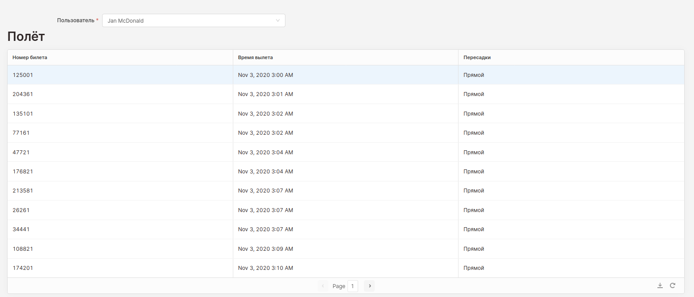

= Создание приложения в среде ORACLE/APEX
:lab: 3
:discipline: Базы данных

== Предисловие
Из-за отсутствия установочных файлов Oracle XE и Apex для дистрибутивов linux debian
был выбран аналогичный инструмент:

https://retool.com[Retool] -- online-инструмент для прототипирования графических интерфейсов, имеющий возможность взаимодействия с БД.

== Получение доступа к БД из Retool
Для доступа к СУБД надо запустить ngrok:
[source,shell]
ngrok tcp 5432

Команда выдаёт внешний хост и порт `tcp://0.tcp.ngrok.io:11220`.

В Retool во вкладке "Resources" создаём новый PostgreSQL:

image::retool-resource.png[]

== Доработка БД

Для удобства разработки необходимо создать представление, в котором будут только рейсы, в которых ещё есть место.

.DDL представления доступных интерфейсов
[source,sql]
----
create or replace view available_flights AS
with tickets_in_flight as (
    select count(ticket_id) as tickets, flight_id from ticket_flights group by flight_id
)
select f.*
from flight f
         join plane p on f.plane = p.id
         join tickets_in_flight on tickets_in_flight.flight_id = f.id
where p.seats > tickets;
----

== Интерфейс регистрации пользователя
.Запрос на регистрацию пользователя
[source,sql]
----
INSERT into passenger (first_name, middle_name, last_name, email,doc_type, doc_serial, phone)
values (
  {{form1.data.fname}},
  {{form1.data.mname || null}},
  {{form1.data.lname}},
  {{form1.data.email}},
  {{form1.data.doc_type}},
  {{form1.data.doc_serial}},
  {{form1.data.phone}}
)
RETURNING id
----

.Заполненная форма регистрации пользователя

== Интерфейс выбора полёта

.Запрос на получение городов отлёта и прибытия
[source,sql]
----
select * from city join airport on airport.city = city.id
----

.Запрос на получение всех возможных маршрутов с пересадками
[source,sql]
----
with recursive root as (
    select 0 as transfer, dep_time, dep_airport, arr_time, arr_airport, id::text as ids
    from available_flights f
    where f.dep_airport = {{dep_airport.value}}
      and f.dep_time >= {{dep_time.value}}

    union

    select root.transfer + 1 as transfer, root.dep_time, root.dep_airport, f.arr_time, f.arr_airport, ids || '/' || f.id
    from root
             join available_flights f on root.arr_airport = f.dep_airport and root.arr_time < f.dep_time
    where transfer <= 2
      and root.arr_time < (f.dep_time + interval '5 hours')
      and f.arr_time < ({{dep_time.value}}::timestamp + interval '24 hours')
)
select *, (arr_time - dep_time) as dur
from root
where arr_airport = {{arr_airport.value}}
order by  dep_time::date, dur
----

.Запрос на регистрацию билета
[source,sql]
----
insert into ticket(passenger, printed, check_machine)
values ({{urlparams.user_id}}, {{moment()}}, {{Math.random()*1e20}})
returning id
----

.Полёты в `ticket_flights` добавляются с помощью внутренних возможностей Retool

.Интерфейс бронирования билета с обратным рейсом

== Билеты в системе

.Запрос на отображение всех билетов в системе
[source,sql]
----
with flights_in_ticket as (
    select ticket_id, count(flight_id) - 1 as transfers from ticket_flights group by ticket_id
)

select min(f.dep_time) as dep_time, transfers::integer, first_name||' '||last_name as name, tf.ticket_id
from ticket t
         join passenger p on t.passenger = p.id
         join flights_in_ticket on t.id = ticket_id
         join ticket_flights tf on t.id = tf.ticket_id
         join flight f on tf.flight_id = f.id
group by tf.ticket_id, transfers, name, tf.ticket_id
order by dep_time
limit {{ Departure.pageSize }}
offset {{ Departure.paginationOffset }}
----

.Интерфейс просмотра билетов

== Билеты пользователя

.Запрос на отображение билетов пользователя
[source,sql]
----
with flights_in_ticket as (
    select ticket_id, count(flight_id) - 1 as transfers from ticket_flights group by ticket_id
)

select min(f.dep_time) as dep_time, transfers::integer, first_name||' '||last_name as name, tf.ticket_id
from ticket t
         join passenger p on t.passenger = p.id
         join flights_in_ticket on t.id = ticket_id
         join ticket_flights tf on t.id = tf.ticket_id
         join flight f on tf.flight_id = f.id
where p.id = {{dep_airport.value}}
group by tf.ticket_id, transfers, name, tf.ticket_id
order by dep_time
limit {{ Departure.pageSize }}
offset {{ Departure.paginationOffset }}
----

.Интерфейс просмотра билетов

== Вывод
В ходе лабораторной работы был получен опыт работы с инструмментами прототипирования бизнеспроцессов.
