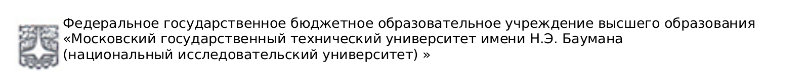

---

== Экзаменационный лист

[grid=no,frame=no,cols="3,4"]
|===
a| «26» июня 2020 г. +
начало *{start-time}* +
окончание *{end-time}* +
оценка *{mark}*

a| дисциплина *{discipline}* +
билет *{ticket-number}* {nbsp}{nbsp}{nbsp} группа *{group-id}* +
студент *{user-name}* +
экзаменатор *{examiner}*
|===

:leveloffset: +1
