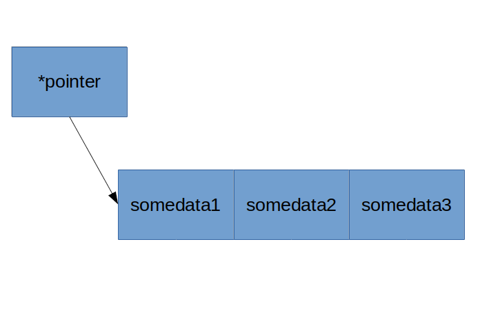

include::exam-attrs.adoc[]
:ticket-number: ____

include::header.part.adoc[]

== Задание 1. Указатели и ссылки. Примеры объявлений

*Указатели* -- переменная, ссылка на начало каких-то данных в памяти (стеке или куче).
В памяти представляется как адрес другого блока в памяти.
На этапе компиляции могут быть как типизированными, так и быть без типа при инициализации (`void`).

Применяется для передачи данных в функцию без копирования,
дают доступ к динамически аллоцированной памяти (`malloc`),
так же являются основным механизмом для реализации динамических объектов, например массивов.

.Схема ссылки указателя на другой участок памяти

.Пример объявления указателей
[source,cpp]
----
int* a = 12; // <1>
int** b = &a; // <2>

char* buffer = nullptr; // <3>
buffer = calloc(10, sizeof(char));

int* arr = new int[4]; // <4>
delete[] arr;
----
<1> -- объявление простого указателя;
<2> -- пример реализации _косвенной адрессации_, получения адреса на участок памяти;
<3> -- практический пример объявления динамической памяти;
<4> -- объявление динамического массива.

*Ссылки* -- переменная-псевдоним для другого объекта.
Является синтаксическим сахором над именами переменных и указателями при компиляции.
Чаще всего используется в аргументах функций для избежания прямой работы с указателями, но при этом чтобы не запускать механизм копирования.

.Пример использования ссылок
[source,cpp]
----
int a = 12;
int &b = a; <1>
// equiv: int *b = &a;
b = 10; // equiv: *b = 10;
assert(a == 10);

auto &currentUserAccount = userService->getFromCache(currentUserId)->account; // <2>
currentUserAccount->getBills();
...

void Inc(int &val) { // <3>
  val += 1;
}
----
<1> -- простейший пример использования ссылок;
<2> -- пример использования ссылок в качестве псевдонимов к значениям;
<3> -- пример реализации процедуры `Inc` из Pascal.
