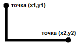

= Домашние задания. Вариант 5
== Задание 1. Программирование на Object Pascal с использованием классов
=== Часть 1.1. Графический редактор
Разработать иерархию классов. Поместить определение классов в отдельном модуле.
Класс, позволяющий рисовать прямую линию от точки, определенной нажатием левой клавиши мыши, до точки ее отпускания.
Класс, позволяющий рисовать зигзаг (прямой угол) от точки, определенной нажатием правой клавиши мыши, до точки ее отпускания.
Толщину линии и цвет задавать с использованием интерфейсных элементов.
В отчете показать иерархии используемых классов VCL и разработанных классов, граф состояния пользовательского интерфейса и объектную декомпозицию.

=== Часть 1.2. Полиморфное наследование
Разработать программу, содержащую описание трех графических объектов:
отрезок, равнобедренный треугольник, стрелка компаса (ромб с короткой диагональю).
Реализуя механизм полиморфизма, привести объекты в одновременное вращение вокруг их геометрических центров с различными угловыми скоростями.
В отчете привести диаграмму используемых классов VCL и разработанных классов, граф состояний пользовательского интерфейса и объектную декомпозицию.

== Задание 2. Программирование на С++
=== Часть 2.1. Функции
Число из n цифр является числом Армстронга, если сумма цифр этого числа, возведенных в степень n, равна самому этому числу. Например: 153 = 13 +53+33. Написать программу, определяющую все числа Армстронга, состоящие из n цифр (n вводится с клавиатуры). Вывести на печать сами числа их количество. При программировании использовать функции.

=== Часть 2.2. Текстовая обработка
Дана последовательность строк. Каждая строка состоит из слов, разделенных пробелами. Написать программу, обеспечивающую ввод строк и их корректировку. Корректировка заключается в удалении или замене слов. Если слово стоит на четном месте и начинается на букву «е», то оно удаляется; если слово стоит на четном месте и начинается на букву «с», то оно замещается на слово, введенное с клавиатуры. Вывести на печать исходную и скорректированную последовательности строк.

=== Часть 2.3. Файлы
Организовать программным способом файл F, состоящий из символьных строк. Переписать в файл G строки файла F, записав символы этих строк в обратном порядке и удалив символы e,E,r,t,U. При возникновении непредвиденных ситуаций выдать соответствующие сообщения. Вывести на экран оба файла.

== Задание 3. Программирование на С++ с использованием классов
=== Часть 3.1. Композиция
Разработать и реализовать диаграмму классов для описанных объектов предметной области, используя механизм композиции. Протестировать все методы каждого класса. Все поля классов должны быть скрытыми (private) или защищенными (protected). Методы не должны содержать операций ввода/вывода, за исключением процедуры, единственной задачей которой является вывод информации об объекте на экран.
Объект – гриб. Поля: название, вес, тип (съедобный, несъедобный, условно съедобный). Методы: процедура инициализации, процедура вывода значений полей на экран и функции, возвращающие значения полей по запросу.
Объект – корзина грибника, в которой лежат грибы. Методы объекта должны позволять: инициализировать объект, добавлять гриб в корзину, убирать гриб из корзины, выводить на экран список собранных грибов с их параметрами и определять, во сколько раз станет легче корзина, если выбросить из нее все несъедобные грибы.
В отчете привести диаграмму разработанных классов и объектную декомпозицию.

=== Часть 3.2. Qt. Полиморфное наследование
Разработать программу, содержащую описание трех графических объектов:
отрезок, равнобедренный треугольник, стрелка компаса (ромб с короткой диагональю).
Реализуя механизм полиморфизма, привести объекты в одновременное вращение вокруг их геометрических центров с различными угловыми скоростями.
В отчете привести диаграмму используемых классов Qt и разработанных классов, граф состояний пользовательского интерфейса и объектную декомпозицию.
