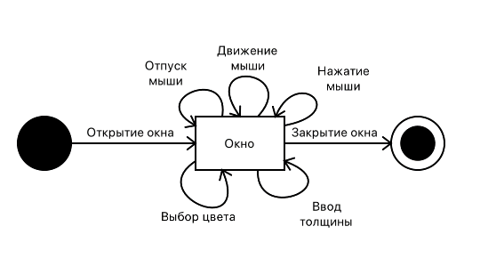
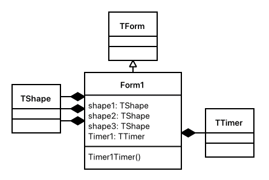
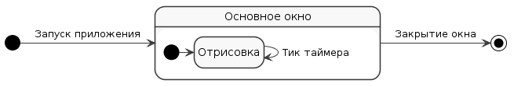
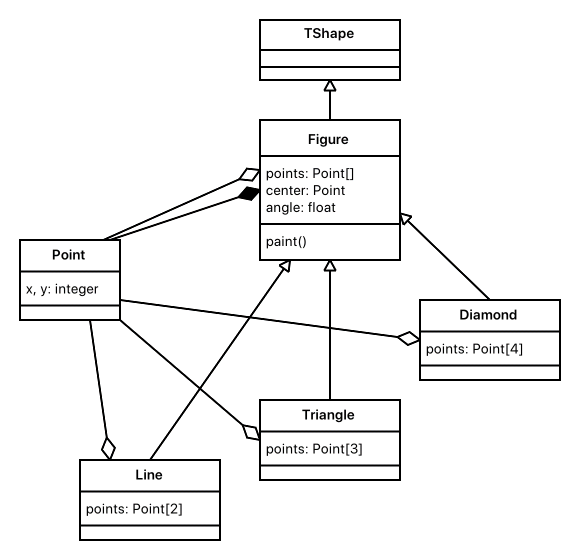

// = Задание 1. Программирование на Object Pascal с использованием классов
== Часть 1. Графический редактор
Разработать иерархию классов. Поместить определение классов в отдельном модуле.

Класс, позволяющий рисовать прямую линию от точки, определенной нажатием левой клавиши мыши, до точки ее отпускания.

Класс, позволяющий рисовать зигзаг (прямой угол) от точки, определенной нажатием правой клавиши мыши, до точки ее отпускания.

Толщину линии и цвет задавать с использованием интерфейсных элементов.
В отчете показать иерархии используемых классов VCL и разработанных классов, граф состояния пользовательского интерфейса и объектную декомпозицию.

.Иерархия VCL классов
image::docs/01.vcl.png[]

[cols=2*,frame=no,grid=no]
|===

a|
.Иерархия разработанных классов

.Граф состояний интерфейса

a|
.Объектная декомпозиция

|===

== Часть 2. Полиморфное наследование
Разработать программу, содержащую описание трех графических объектов: отрезок, равнобедренный треугольник, стрелка компаса (ромб с короткой диагональю).

Реализуя механизм полиморфизма, привести объекты в одновременное вращение вокруг их геометрических центров с различными угловыми скоростями.

В отчете привести диаграмму используемых классов VCL и разработанных классов, граф состояний пользовательского интерфейса и объектную декомпозицию.

[cols=2*,frame=no,grid=no]
|===
a|
.Иерархия VCL классов

a|
.Граф состояний интерфейса

a|
.Иерархия разработанных классов

a|
.Объектная декомпозиция
image::docs/02.decomposition.png[]
|===
