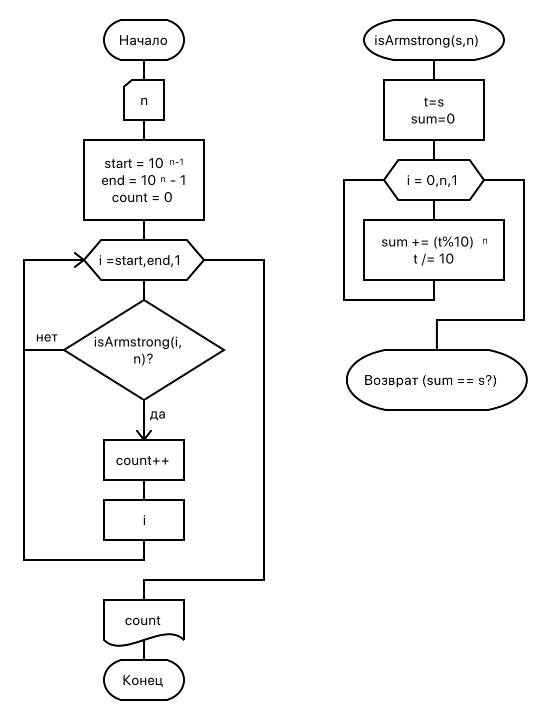
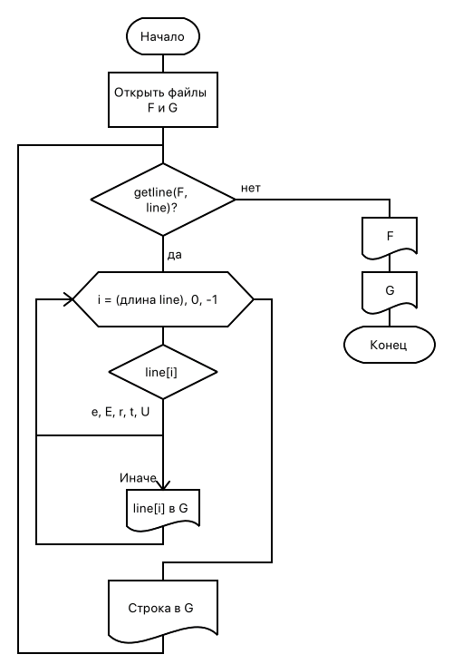

== Задание 2. Программирование на С++
=== Часть 2.1. Функции
Число из n цифр является числом Армстронга, если сумма цифр этого числа, возведенных в степень n, равна самому этому числу. Например: 153 = 1*1*1 + 5*5*5 + 3*3*3. Написать программу, определяющую все числа Армстронга, состоящие из n цифр (n вводится с клавиатуры). Вывести на печать сами числа их количество. При программировании использовать функции.

.Код решения
[source,cpp]
----
include::01/main.cpp[]
----

.Схема алгоритма

=== Часть 2.2. Текстовая обработка
Дана последовательность строк. Каждая строка состоит из слов, разделенных пробелами. Написать программу, обеспечивающую ввод строк и их корректировку. Корректировка заключается в удалении или замене слов. Если слово стоит на четном месте и начинается на букву «е», то оно удаляется; если слово стоит на четном месте и начинается на букву «с», то оно замещается на слово, введенное с клавиатуры. Вывести на печать исходную и скорректированную последовательности строк.

.Код решения
[source,cpp]
----
include::02/main.cpp[]
----

// .Схема алгоритма
// image::02/schema.png[]

=== Часть 2.3. Файлы
Организовать программным способом файл F, состоящий из символьных строк. Переписать в файл G строки файла F, записав символы этих строк в обратном порядке и удалив символы e,E,r,t,U. При возникновении непредвиденных ситуаций выдать соответствующие сообщения. Вывести на экран оба файла.

.Код решения
[source,cpp]
----
include::03/main.cpp[]
----

.Схема алгоритма

