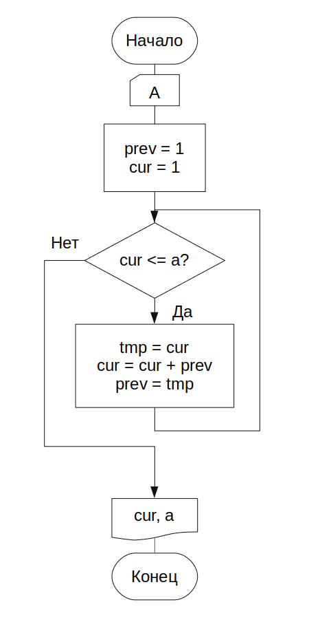

== Задание

Числа Фибоначчи вычисляются следующим образом: а~1~ = а~2~ =1, а~n~ = a~n-1~ + a~n-2~. Определить первое число последовательности Фибоначчи, значение которого превышает А, введенное в клавиатуры.

[frame=no, grid=no,cols=2]
|===

a|

.Код решения
[source,cpp]
----
include::main.cpp[]
----

*Вывод*: я научился использовать основные операторы C++.

a|

.Схема алгоритма

|===
.Результаты тестирования
[%header,cols=3*]
|===
|Входные |Результат |Ожидается
|1 |2 |2
|3 |5 |5
|7 |8 |8

|===
