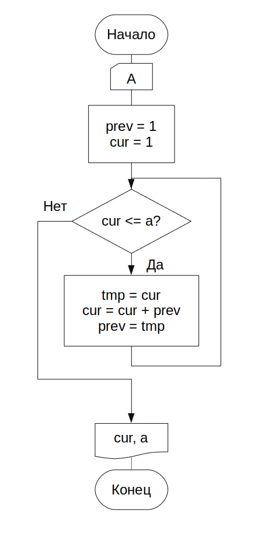

== Задание

Числа Фибоначчи вычисляются следующим образом: а~1~ = а~2~ =1, а~n~ = a~n-1~ + a~n-2~. Определить первое число последовательности Фибоначчи, значение которого превышает А, введенное в клавиатуры.

.Код решения
[source,cpp]
----
include::main.cpp[]
----

.Схема алгоритма

*Вывод*: я научился использовать основные операторы C++.
