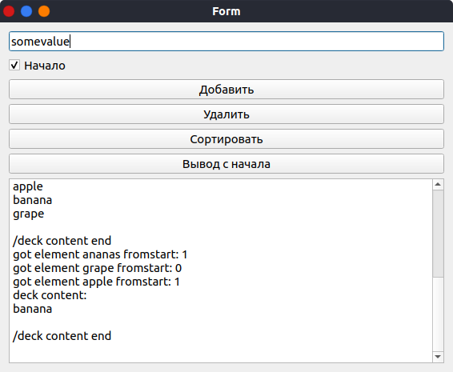

//== Лабораторная работа 10. Qt. Создание контейнеров

== Задание

Моделировать дек, в качестве элементов которого могут использоваться целые числа и слова.
Операции: добавление элемента, удаление элемента, печать элементов.
При добавлении и удалении элементов выбирать сторону дека: начало или конец.
Создать класс-потомок, который содержит функцию сортировки элементов (числа по возрастанию, слова по алфавиту).
Тестировать полученную модель.
Разработать собственную иерархию классов, готовые контейнеры Qt не использовать.
Пользовательский интерфейс для работы с моделью реализовать на Qt.
В отчете представить диаграмму классов и обосновать выбранную структуру представления данных.

.Схема разработанных классов
[plantuml]
....

skinparam classBackgroundColor transparent
skinparam shadowing false
skinparam monochrome true
skinparam linetype polyline

set namespaceSeparator ::

class Qt::QWidget

class El<T> {
  +El *next
  +El *prev
  +T val
}

class Deck<T> {
  #El<T> *start
  #El<T> *end
  +T pop(bool fromStart)
  +void push(T el, bool toStart)
  +QString toString()
}

class SortableDeck<T> {
  +void sort();

  -bool grater(T a, T b);
  -void pushOrdered(T val);
}

class SortableDeckForm {
  -Ui::SortableDeckForm *ui
  -SortableDeck<QString> *deck

__ public slots __
  +void push()
  +void pop()
  +void sort()
  +void print()
}

Deck "0.." o- El
Deck <|-- SortableDeck
SortableDeckForm *- SortableDeck
Qt::QWidget <|-- SortableDeckForm
....

.Реализация Deck.h
[source,cpp]
----
include::Deck.h[]
----

.Реализация SortableDeck.h
[source,cpp]
----
include::SortableDeck.h[]
----

[frame=no,grid=no,cols=2]
|===
a|
.Реализация методов SortableDeckForm.cpp
[source,cpp]
----
include::sortabledeckform.cpp[]
----

a|
.Результаты тестирования
----
add element apple instart: 0
add element banana instart: 0
add element grape instart: 1
add element ananas instart: 1
deck content:
ananas
grape
apple
banana

/deck content end
deck sorted
deck content:
ananas
apple
banana
grape

/deck content end
got element ananas fromstart: 1
got element grape fromstart: 0
got element apple fromstart: 1
deck content:
banana

/deck content end
----

.Разработанная форма интерфейса

|===

Данная структура была выбрана, так как для требуемого функционала наиболее удобным является размещение всех элементов на одном окне. Также данная структура более понятна для чтения другим программистам, которые потенциально будут использовать и модифицировать эту программу.

**Вывод**:
Я научился реализовывать контейнеры в C++ с помощью шаблонов и создавать интерфейс для работы с контейнерами с помощью Qt.
