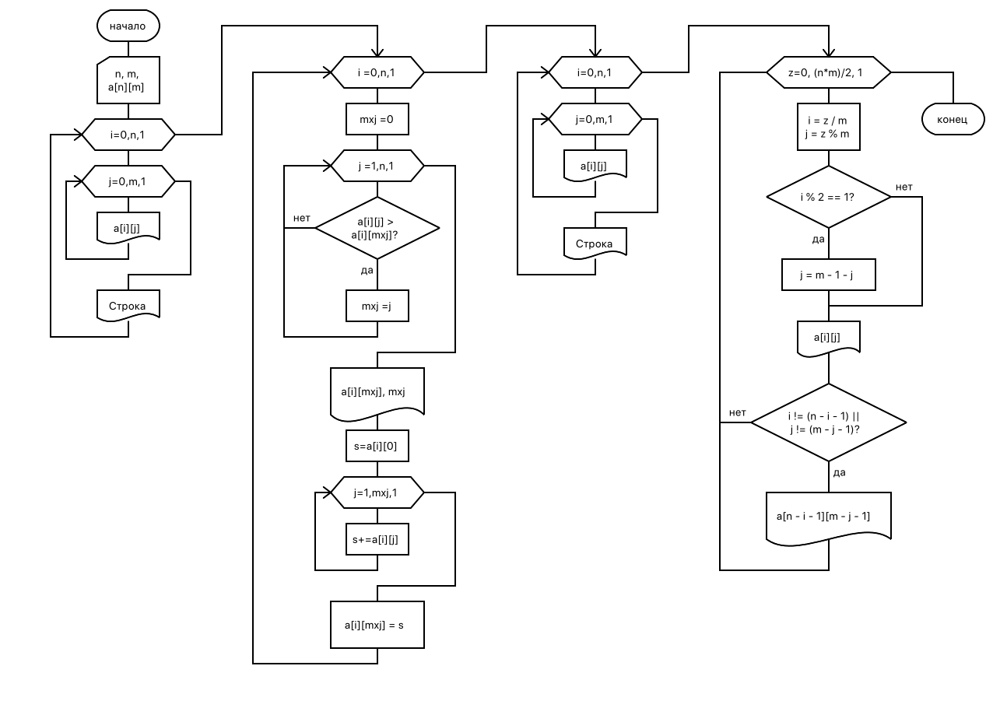

= Задание

В целочисленной матрице D(N,M), где N<M в каждой строке найти наибольшее значение и заменить его суммой элементов строки, предшествующих этому наибольшему значению. Если наибольший элемент является первым в строке, то преобразование не производить. Распечатать:

. исходную и преобразованную матрицы;
. индексы и значения тех элементов, которые оказались наибольшими в строках;
. вывести однократно все элементы матрицы, проводя обход «змейкой» одновременно с двух сторон: элементы [1,1], [N,M], [1,2], [N,M-1]…

.Схема алгоритма

.Код решения
[source, cpp]
----
include::main.cpp[]
----

.Результат тестирования
----
Исходная матрица:
   6   3   5   8
   5   2   9   1
   9   2   3   4

Преобразование матрицы:
Наибольшой элемент 8 на 3
Наибольшой элемент 9 на 2
Наибольшой элемент 9 на 0

Преобразованная матрица:
   6   3   5  14
   5   2   7   1
   9   2   3   4

Вывод змейки:
6 - 4 - 3 - 3 - 5 - 2 - 14 - 9 - 1 - 5 - 7 - 2 -
----

*Вывод*: Я научился использовать массивы в C++.
