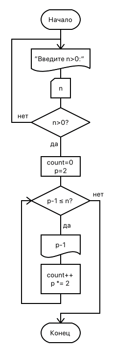

// = Лабораторная работа 3. Программирование функций
== Задание

Натуральное число называется числом Мерсенна, если оно может быть представлено в виде 2^p^-1, где p – тоже натуральное число. Для простых чисел Мерсенна значение p тоже простое. Написать программу, определяющую количество простых чисел Мерсенна ≤ некоторого n (вводится с клавиатуры). Вывести на печать числа Мерсенна и их количество в указанном диапазоне.

[frame=no,grid=no,cols=3]
|===
a|
.Схема алгоритма

a|
.Код программы
[source,cpp]
----
include::main.cpp[]
----
a|
.Результат тестирования
----
Введите N>0: 10
1
3
7
M_n <= 10  - 3шт.

Введите N>0: 5
1
3
M_n <= 5  - 2шт.

Введите N>0: 20
1
3
7
15
M_n <= 20  - 4шт.
----
|===

*Вывод*: Я научился определять и использовать функции в C++.
