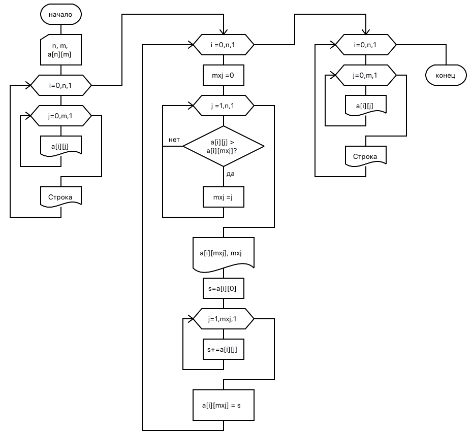

== Работа с массивами C++. Адресная арифметика. Вариант 6

В целочисленной матрице D(3, 4) в каждой строке найти наибольшее значение и заменить его суммой элементов строки, предшествующих этому наибольшему значению. Если наибольший элемент является первым в строке, то преобразование не производится.

.Распечатать:
. исходную и преобразованную матрицы
. адреса тех элементов, которе оказались наибольшими в строках

[frame=no,grid=no,cols=2]
|===
a|

.Код решения
[source,cpp]
----
include::main.cpp[]
----
a|
.Результаты тестирования
----
Исходная матрица:
   1   2   6   3
   8   9   6   1
   9   2   3   4

Преобразование матрицы:
Наибольшой элемент 6 на 2 (0x7ffc753f8428)
Наибольшой элемент 9 на 1 (0x7ffc753f8434)
Наибольшой элемент 9 на 0 (0x7ffc753f8440)

Преобразованная матрица:
   1   2   3   3
   8   8   6   1
   9   2   3   4
----

|===
.Схема алгоритма

