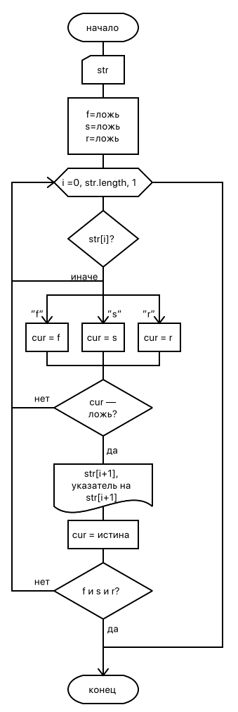

// = Лабораторная работа 5. Использование указателей при работе со строками С++

== Задание
Известно, что в заданном тексте присутствуют буквы f, r, s. Требуется напечатать символы, непосредственно следующие за первым вхождением каждой из этих букв (всего 3 символа). Пользуясь указателями, выдать на печать адреса этих символов.

[grid=no,frame=no,cols=2]
|===
a|
.Код
[source,cpp]
----
include::main.cpp[]
----

.Тестирование
----
Enter text
farbsc
a -> 0x7ffc89f3d2a1
b -> 0x7ffc89f3d2a3
c -> 0x7ffc89f3d2a5

Enter text
rcfafbfcsg
c -> 0x7fffe0408d81
a -> 0x7fffe0408d83
g -> 0x7fffe0408d89
----

a|

.Схема алгоритма

|===

**Вывод**: я научился работать с указателями в строках в C++.
