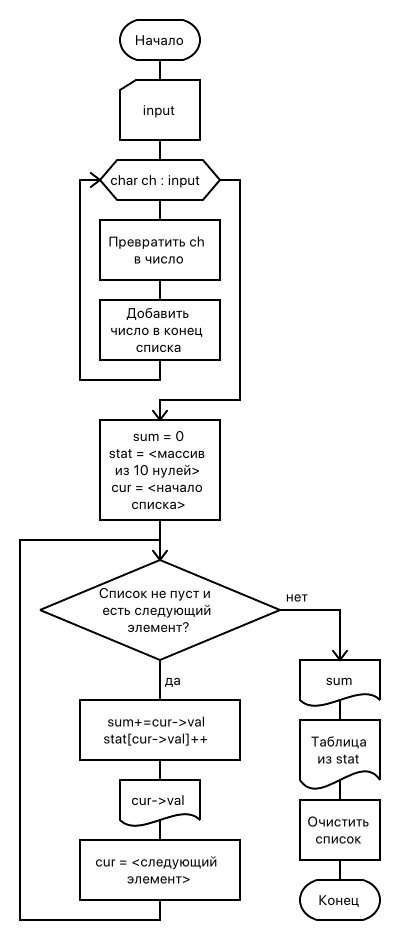

== Задание
Дана символьная строка, представляющая собой некоторое длинное целое число. Составить программу, которая вводит строку, организует из цифр введенной строки, преобразованных в целое число, однонаправленный список. Используя сформированный список, подсчитать сумму цифр введенного числа и количество повторений каждой цифры. Вывести на печать сформированный список, найденную сумму и количество повторений цифр в виде таблицы.

.Тестирование
[%header,cols=3*]
|===
|Ввод |Результат |Ожидается

|1234567876543456789
a|
----
1 : 2 : 3 : 4 : 5 : 6 : 7 : 8 : 7 : 6 : 5 : 4 : 3 : 4 : 5 : 6 : 7 : 8 : 9 :
Sum: 100

Table
1:    1
2:    1
3:    2
4:    3
5:    3
6:    3
7:    3
8:    2
9:    1
----
a|
----
1 : 2 : 3 : 4 : 5 : 6 : 7 : 8 : 7 : 6 : 5 : 4 : 3 : 4 : 5 : 6 : 7 : 8 : 9 :
Sum: 100

Table
1:    1
2:    1
3:    2
4:    3
5:    3
6:    3
7:    3
8:    2
9:    1
----
|1236532
a|
----
1 : 2 : 3 : 6 : 5 : 3 : 2 : 
Sum: 22

Table
1:    1
2:    2
3:    2
5:    1
6:    1
----
a|
----
1 : 2 : 3 : 6 : 5 : 3 : 2 : 
Sum: 22

Table
1:    1
2:    2
3:    2
5:    1
6:    1
----
|===

[frame=no,grid=no,cols=2]
|===
a|
.Код решения
[source,cpp]
----
include::main.cpp[]
----
a|
.Схема алгоритма

|===

*Вывод*: я научился работать с дианмическими данными в C++.
