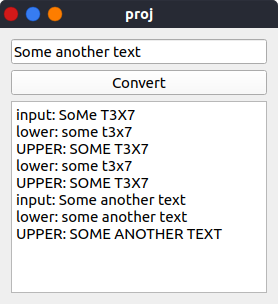

## Простые приложения
[cols=2*,frame=no,grid=no]
|===
a|
.Простого приложения

.Приложение в Qt Designer

a|
.Использование виджетов

|===

## Калькулятор
[cols=2*,frame=no,grid=no]
|===
a|
.Калькулятор

a|
.Продвинутый калькулятор

|===

Для реализации в конструкторе виджета калькулятора были добавлен следующий код

[cols=2*,frame=no,grid=no]
|===
a|
.Дополнительные переменные компилятора
[source,cpp,indent=0]
----
include::proj/calcform.cpp[tag=defs]
----

.Дополнительный класс компановщика
[source,cpp,indent=0]
----
include::proj/calcform.cpp[tag=layout]
----

.Наполнение компановщика
[source,cpp,indent=0]
----
include::proj/calcform.cpp[tag=elseif]
----

a|

.Дополнительные кнопки
[source,cpp,indent=0]
----
include::proj/calcform.cpp[tag=btns]
----

.Новые бинарные операции
[source,cpp,indent=0]
----
include::proj/calcform.cpp[tag=bin]
----

.Новые унарные операции
[source,cpp,indent=0]
----
include::proj/calcform.cpp[tag=unary]
----
|===

<<<

## Ввод-вывод

[cols=2,frame=no,grid=no]
|===
a|
.texteditor.h
[source,cpp]
----
include::proj/texteditor.h[]
----

.Простой текстовый ввод

a|
.texteditor.cpp
[source,cpp]
----
include::proj/texteditor.cpp[]
----
|===

## Вывод
Я научился работать с компонентами и контейнерами библиотеки Qt.
