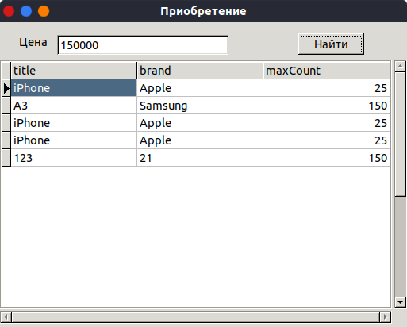
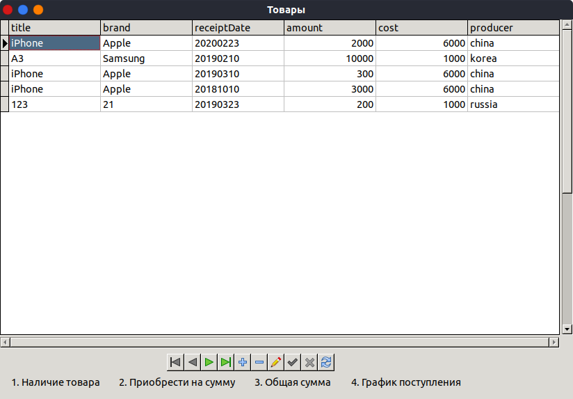
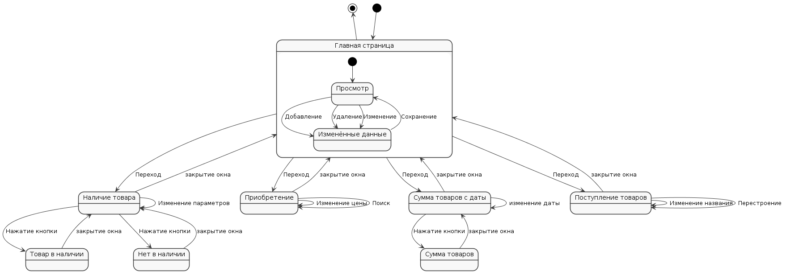
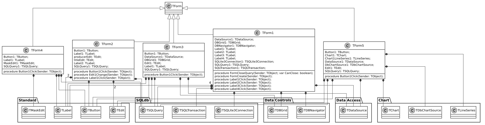

= Создание программной системы в Turbo Delphi

Выполнить объектную декомпозицию, разработать формы интерфейса, диаграмму состояний интерфейса, диаграммы классов интерфейсной и предметной областей, диаграмму последовательностей одной из реализуемых операций. Разработать, протестировать и отладить программу в среде Turbo Delphi. База данных коммерческого магазина содержит сведения о товарах: наименование и марка товара, дата поступления, количество штук, установленная цена, страна-производитель. Программа должна в интерактивном режиме формировать файл, добавлять и удалять данные, а также воспринимать каждый из перечисленных запросов и давать на него
ответ.

. Определить, есть ли в магазине указанный товар производства данной страны.
. Определить, можно ли приобрести за данную сумму и, если да, то, сколько телефонных аппаратов каждой марки (выбрать все варианты по схеме "наименование и марка - максимально возможное количество").
. Определить, на какую общую сумму поступили товары, начиная с указанной даты.
. Построить график поступления заданного товара по датам.

== Объектная декомпозиция приложения

При проектировании программного продукта были выделены следующие объекты предметной области:

. База данных
. Запрос к базе данных
. Формы, показывающее результаты запросов
. Элементы ввода-вывода информации в формах

.Объектная декомпозиция
[plantuml]
....
include::docs/object-decomp.pu[]
....

== Разработка форм интерфейса
Разрабатываемые формы интерфейса должны обеспечивать пользователю возможность выполнения заданных функций.

Форма "Приобретение" предназначена для отображения количества телефонных аппаратов, которые можно приобрести на определённую сумму, соответственно она должна включать кнопки, обеспечивающие ввод суммы, инициализацию запроса к базе данных и таблицу для отображения названия аппарата и количества.

.Форма "Приобритение"

Форма "Товары" предназначена для отображения текущего состояния базы данных и её изменения, а также открытие остальных форм, соответственно она должна включать кнопки, обеспечивающие добавление и удаление строк в БД и открытие других форм.

.Форма "Товары"

Форма "Поступление товаров" предназначена для отображения графика поступления товаров по датам, соответственно она должна включать поле ввода наименования товара и кнопку построения графика.

.Форма "Поступление товаров"

Форма "Наличие товара" предназначена для отображения наличия товара определённого производителя и определённой марки, соответственно она должна включать поля ввода производителя товара и марки, а также кнопку построения получения результата.

.Форма "Поступление товаров"

== Разработка диаграммы состояний интерфейса
Диаграмма состояний интерфейса показывает возможные варианты переключения форм интерфейса.

.Диаграмма состояний пользовательского интерфейса

Аналогично разрабатываются диаграммы состояний интерфейса для отдельных форм.

== Разработка диаграммы классов интерфейсной и предметной областей приложения
Диаграмма классов интерфейсной и предметной областей показывает связи между классами.

.Диаграмма классов интерфейсной и объектной области

== Разработка диаграммы последовательности действий выполнения операции "Наличие товара в магазине"
Диаграмма последовательностей действий позволяет уточнить порядок выполнения фрагментов операции различными объектами.

.Диаграмма последовательностей запроса наличия в магазине
[plantuml]
....
include::docs/sequence.pu[]
....

== Разработка кода приложения
Уточнение поведения объектов во время выполнения программы позволило разработать код программы.

.Код главного окна редактора. unit1.pas
[source,pascal]
----
include::unit1.pas[]
----

Аналогично был разработан остальной код приложения.

== Тестирование приложения
Разработанное приложение позволяет выполнять функции, предусмотренные заданием

.Интерактивное удаление и добавление элементов базы данных

.Получение графка поставок определённого продукта
image::docs/forms/graph.png[]

.Получение количества телефонов при гипотетической покупке

== Вывод
При разработке приложения изучены средства разработки приложений с графическим интерфейсом на языке Object Pascal, используемые при объектном подходе,
а также основные диаграммы, сопровождающие процесс разработки.
