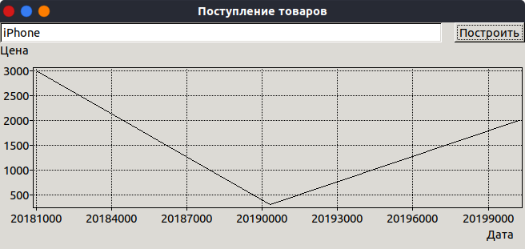

= Задание 1. Создание программной системы в Turbo Delphi

Выполнить объектную декомпозицию, разработать формы интерфейса, диаграмму состояний интерфейса, диаграммы классов интерфейсной и предметной областей, диаграмму последовательностей одной из реализуемых операций. Разработать, протестировать и отладить программу в среде Turbo Delphi. База данных коммерческого магазина содержит сведения о товарах: наименование и марка товара, дата поступления, количество штук, установленная цена, страна-производитель. Программа должна в интерактивном режиме формировать файл, добавлять и удалять данные, а также воспринимать каждый из перечисленных запросов и давать на него
ответ.

. Определить, есть ли в магазине указанный товар производства данной страны.
. Определить, можно ли приобрести за данную сумму и, если да, то, сколько телефонных аппаратов каждой марки (выбрать все варианты по схеме "наименование и марка - максимально возможное количество").
. Определить, на какую общую сумму поступили товары, начиная с указанной даты.
. Построить график поступления заданного товара по датам.

== Анализ задания
По условиям задачи необходимо выполнять поиск данных, получение, изменение, создание и агрегацию.
Также обязательным условием является интерактивное создание файла в файловой системе.
Для решения задачи можно использовать СУБД SQLite3. В ней создать таблицу `products` и выполнять SQL запросы к этой таблице.

== Схемы и тексты
.Структура таблицы `products`
[source,sql]
----
CREATE TABLE products (
	title VARCHAR NOT NULL, -- название модели
	brand VARCHAR NOT NULL, -- марка телефона
	receiptDate VARCHAR NOT NULL, -- дата поставки. ISO 8601
	amount INT NOT NULL, -- количество товара
	cost INT NOT NULL, -- цена за штуку
	producer VARCHAR NOT NULL -- страна-производитель
)
----

.Реализация запроса для функции №2
[source,sql]
----
SELECT
  title,
  brand,
  min((:cost / cost), amount) AS maxCount
FROM products
WHERE cost < :cost
----

.Объектная декомпозиция
[plantuml]
....
include::docs/object-decomp.pu[]
....

.Граф состояний пользовательского интерфейса
image::docs/ui-graph.png[]

.Диаграмма классов интерфейсной и объектной области
image::docs/vlc.png[]

.Диаграмма последовательностей запроса наличия в магазине
image::docs/sequence.png[]

== Реализация программы
=== Код программы

.Код главного окна редактора. unit1.pas
[source,pascal]
----
include::unit1.pas[]
----

.Код окна проверки наличия товара. unit2.pas
[source,pascal]
----
include::unit2.pas[]
----

.Код окна таблицы возможной покупок. unit3.pas
[source,pascal]
----
include::unit3.pas[]
----

.Код окна получения суммарной стоимости товаров на складе за определённую дату. unit4.pas
[source,pascal]
----
include::unit4.pas[]
----

.Код окна построения графика поступления товара на склад. unit5.pas
[source,pascal]
----
include::unit5.pas[]
----

<<<

=== Формы пользовательского интерфейса

.Главная форма-редактор

.Форма проверки наличия товара на складе

.Форма потенциального приобретения
image::docs/forms/get.png[]

.Форма получения стоимости товара на определённую дату

.Форма построения графика поступления товара

== Вывод
Я получил практические знания реализации форм интерфейса в Turbo Delphi, реализации обращения к СУБД SQLite3 и построения графиков.
