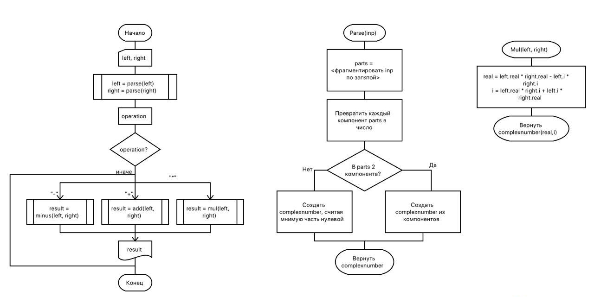

= Создание программной системы с элементарным интерфейсом консольного режима С++

Выполнить структурную декомпозицию, разработать структурную схему, содержащую не менее 3 подпрограмм, и алгоритмы этих подпрограмм.
Реализовать на С++ в консольном режиме.
Предусмотреть примитивный интерфейс типа меню, позволяющий выбирать нужную подпрограмму.

Разработать программу, которая реализует операции над комплексными числами.

Реализовать следующие операции:

. ввод чисел
. суммирование
. вычитание
. умножение на скаляр
. вывод результатов операций на экран

== Структурная декомпозиция приложения
При проектировании программного продукта были выделены следующие структурные части:

. Главная функция приложения
. Функция разбора пользовательского ввода
. Функция умножения
. Функция сложения
. Функция вычитания
. Функция представления данных в текстовом виде

.Структурная декомпозиция программы
[plantuml]
....
skinparam classBackgroundColor transparent
skinparam shadowing false
skinparam monochrome true

usecase "Main programm" as main
usecase "Parser producer" as parse

rectangle ComplexNumber {
  usecase "Add (+)" as add
  usecase "Minus (-)" as min
  usecase "Multiply (*)" as mul
  usecase "Print (<<)" as print
}

main --> parse
main --> add
main --> min
main --> mul
main --> print
....

== Схема алгоритма
Программный продукт должен работать по следующему алгоритму.

.Схема алгоритма

[NOTE]
Подпрограммы `add` и `minus` аналогичны подпрограмме `mul`.

== Разработка консольного интерфейса
Диаграмма состояний интерфейса показывает путь пользователя в интерфейсе.

.Диаграмма состояний пользовательского интерфейса
[plantuml]
....
skinparam monochrome true
skinparam shadowing false

(*) -> "Ввод первого числа"
-> "Ввод второго числа"
-> "Выбор оператора"
-> "Вывод результата"
-> (*)
....

== Разработка формата ввода-вывода комплексных чисел
Пользователю нужно вводить отдельно действительную и мнимую части комплексного числа.
Мнимая часть так же может быть равна нулю и тогда число будет просто действительным.

В результате был разработн следующий синтаксис ввода-вывода комплексных чисел.

.Схема синтаксиса ввода-вывода чисел
----
number := <real>[, ]
real := [-]<decimal>
img := [-]<decimal>
----

== Реализация

.Код реализации основной программы. main.cpp
[source, cpp]
----
include::main.cpp[]
----

.Код реализации методов класса
[source,cpp]
----
include::ComplexNumber.cpp[]
----

.Пример работы программы
[source]
----
Format of complex numbers: <real>[,<imagine>]

Enter first number:
1,0.5
Enter second number:
12,-4
Enter operator (+, -, *):
+
Result: 13, -3.5
----

== Вывод
Я научился реализовывать классы в C++, а так же простейшие последовательные консольные пользовательские интерфейсы.
Также я попрактиковался в реализации простейших операций с комплексными числами.
