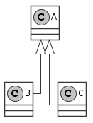
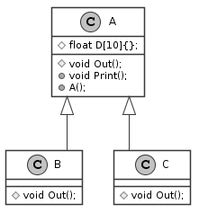

= РК3. ООП. Вариант 5. Бобренко Иван

Реализовать иерархию классов в соответствии с рисунком:

. Класс `А` должен включать:
  - конструктор, инициализирующий массив `D` вещественных чисел из 10-ти элементов;
  - абстрактный метод `Out` для реализации механизма полиморфизма;
  - метод `Print`, содержащий обращение к методу `Out` для вывода массива;
. Класс `B` должен включать метод `Out`, позволяющий выводить массив `D` на экран в одну строку.
. Класс `C` должен включать метод `Out`, который выводит элементы массива `D` на экран по одному в строке.
. Продемонстрировать работу метода `Print` для объектов классов `B` и `C`.
. Изобразить подробную диаграму классов.

.Результат работы программы
----
=== B class ===
771.8	215.37	765.091	985.221	310.39	330.234	242.005	383.433	168.997	371.018
=== C class ===
771.8
215.37
765.091
985.221
310.39
330.234
242.005
383.433
168.997
371.018
----

.Диаграма классов

