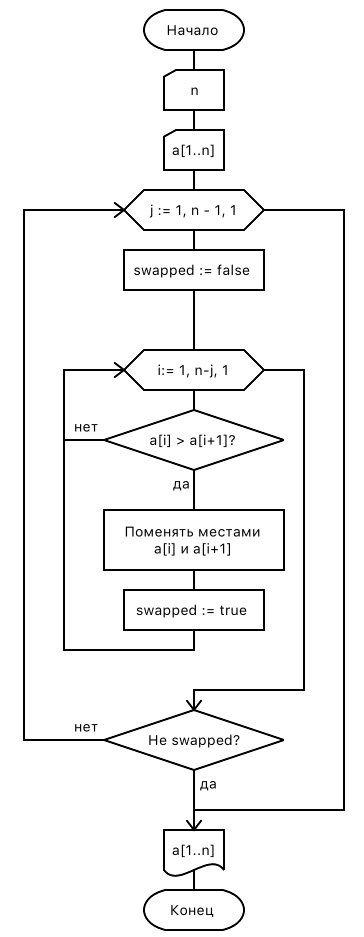
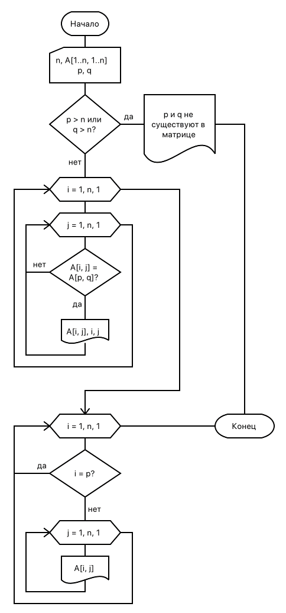
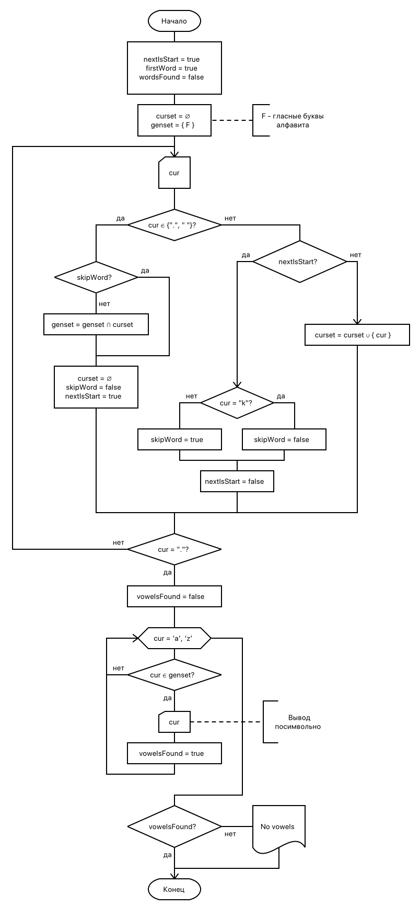
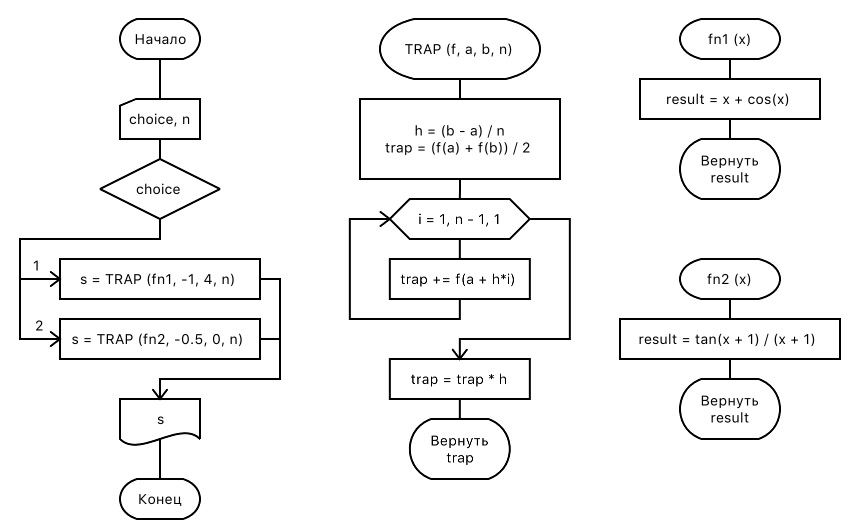

:le: &#8804;

== Часть 1. Обработка одномерных массивов
Сортировать одномерный массив символов по алфавиту. Использовать метод обменов.

[cols="2*", frame=none, grid=none]
|===
a|.Схема алгоритма

a|.Код решения
[source,pascal]
----
include::01.pas[]
----
|===

.Тестирование части 1
[%header, cols=3*, frame=none,grid=no]
|===
|Входные данные |Ожидается |Результат

a|
--
26
qwertyuiopasdfghjklzxcvbnm
--
a|
--
abcdefghijklmnopqrstuvwxyz
--
a|
--
abcdefghijklmnopqrstuvwxyz
--

a|
--
4
bcad
--
a|
--
abcd
--
a|
--
abcd
--

a|
--
4
AbCd
--
a|
--
ACbd
--
a|
--
ACbd
--
|===

== Часть 2. Обработка матриц
Дана целочисленная матрица R(n,n), n < 11 и целые числа p и q (1 {le} p {le} 11; 1 {le} q {le} 11). Определить сколько элементов, равных элементу r~pq~, содержит матрица. Вывести на печать исходную матрицу, найденные элементы и их номера строки и столбца. Удалить строку с элементом r~pq~. Вывести на экран полученную матрицу.

=== Тестирование
.Исходная матрица для тестирования 4x4
----
1 2 3 4
5 6 7 8
9 0 1 2
3 4 5 6
----

[%header,cols=2*,grid=no,frame=no]
|===
|При p=2 q=2 (r = 6)
|При p=3 q=2 (r = 0)

a|
----
elements eql r:
   el    i    j
---------------
    6    2    2
    6    4    4

matix without row 2:
    1    2    3    4
    9    0    1    2
    3    4    5    6
----

a|
----
elements eql r:
   el    i    j
---------------
    0    3    2

matix without row 3:
    1    2    3    4
    5    6    7    8
    3    4    5    6
----
|===

[grid=no, frame=no, cols=2*]
|===
a|.Схема алгоритма

a|.Код решения
[source,pascal]
----
include::02.pas[]
----
|===

<<<

== Часть 3. Применение множеств
Составить программу, используя множественный тип.
Дана последовательность слов из латинских букв, разделенных пробелами, в конце точка. Определить, какие гласные буквы есть во всех словах этой последовательности, начинающихся с буквы «k». Вывести на экран найденные символы в алфавитном порядке. При отсутствии таких слов выдать соответствующее сообщение.

.Схема алгоритма

.Код решения
[source,pascal]
----
include::03.pas[]
----

.Тестирование
[%header,cols=3*,frame=no,grid=no]
|===
|Вход |Ожидается |Результат

m|keanu monok kanulo.
m|a u
m|a u

m|real meeeeat.
m|no vowels
m|no vowels

m|kasabian korone.
m|no vowels
m|no vowels

|===

<<<

== Часть 4. Создание модулей. Процедурный тип параметров
Разработать модуль, содержащий указанные процедуры и функции. Написать тестирующую программу.

Составить подпрограмму-процедуру TRAP для вычисления площади, ограниченной заданной функцией и осью x на заданном интервале по формуле image:formula-1.png[formula, pdfwidth=100, align="center"], где f(x){nbsp}–{nbsp}заданная функция, [a, b]{nbsp}–{nbsp}заданный интервал, n{nbsp}–{nbsp}число отрезков разбиения интервала, h{nbsp}–{nbsp}шаг изменения x, находится по формуле (b-a)/n.

Функцию f(x) передать в процедуру через параметр. В основной программе использовать процедуру TRAP для вычисления площади, ограниченной функциями:

. x + cos(x), a = -1, b = 4,
. tg(x+1)/(x+1), a = -0,5, b = 0.

Количество разбиений n задается с клавиатуры в основной программе. Проверить программу при n=10,20,30.

.Схема алгоритма

[cols="2*", grid="none", frame="none"]
|===
.2+a|.Код тестирующей программы
[source,pascal]
----
include::04.pas[]
----

a|.Код модуля Trap
[source,pascal]
----
include::Trap.pas[]
----

.>a|
== Результаты работы
[%header,cols=2.2, grid=no, frame=no]
!===
m!x + cos(x) m!tg(x+1)/(x+1)

a!
[horizontal]
x = 10:: 7.5828971689
x = 20:: 7.5842270477
x = 30:: 7.5844724068

a!
[horizontal]
x = 10:: 0.6346667349
x = 20:: 0.6344394371
x = 30:: 0.6343973095

!===

|===

