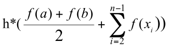

:le: &#8804;

== Часть 1. Обработка одномерных массивов
Сортировать одномерный массив символов по алфавиту. Использовать метод обменов.

[cols="2*", frame=none, grid=none]
|===
a|.Схема алгоритма
image::01.jpeg[]
a|.Код решения
[source,pascal]
----
include::01.pas[]
----
|===

.Тестирование
*TODO*

<<<

== Часть 2. Обработка матриц
Дана целочисленная матрица R(n,n), n<11 и целые числа p и q (1 {le} p {le} 11; 1 {le} q {le} 11). Определить сколько элементов, равных элементу r~pq~, содержит матрица. Вывести на печать исходную матрицу, найденные элементы и их номера строки и столбца. Удалить строку с элементом r~pq~. Вывести на экран полученную матрицу.

.Схема алгоритма
todo

.Код решения
[source,pascal]
----
include::02.pas[]
----

.Тестирование
TODO

<<<

== Часть 3. Применение множеств
Составить программу, используя множественный тип.
Дана последовательность слов из латинских букв, разделенных пробелами, в конце точка. Определить, какие гласные буквы есть во всех словах этой последовательности, начинающихся с буквы «k». Вывести на экран найденные символы в алфавитном порядке. При отсутствии таких слов выдать соответствующее сообщение.

.Схема алгоритма
TODO

.Код решения
[source,pascal]
----
include::03.pas[]
----

.Тестирование
|==
|TODO
|==

<<<

== Часть 4. Создание модулей. Процедурный тип параметров
Разработать модуль, содержащий указанные процедуры и функции. Написать тестирующую программу.

Составить подпрограмму-процедуру TRAP для вычисления площади, ограниченной заданной функцией и осью x на заданном интервале по формуле , где f(x) – заданная функция, [a, b] – заданный интервал, n – число отрезков разбиения интервала, h – шаг изменения x, находится по формуле (b-a)/n.

Функцию f(x) передать в процедуру через параметр. В основной программе использовать процедуру TRAP для вычисления площади, ограниченной функциями:

. x + cos(x), a = -1, b = 4,
. tg(x+1)/(x+1), a = -0,5, b = 0.

Количество разбиений n задается с клавиатуры в основной программе. Проверить программу при n=10,20,30.

.Схема алгоритма
todo

[cols="2*", grid="none", frame="none"]
|===
a|.Код модуля Trap
[source,pascal]
----
include::Trap.pas[]
----
a|.Код тестирующей программы
[source,pascal]
----
include::04.pas[]
----
|===

.Тестирование
|===
|TODO
|===