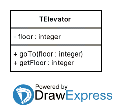

== Часть 1. Простые объекты
Описать объект, включающий заданные поля и методы. Написать программу, которая создает объект и тестирует его методы.

Объект – лифт. Поле: номер этажа, на котором в данный момент находится лифт. Методы: инициализирующая процедура, процедура перемещения лифта на заданный этаж и функция, возвращающая номер текущего этажа.

.Схема объекта

.Код реализации объекта "Лифт"
[source,pascal]
----
include::01.pas[]
----