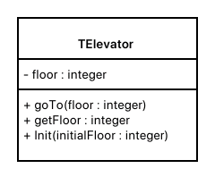
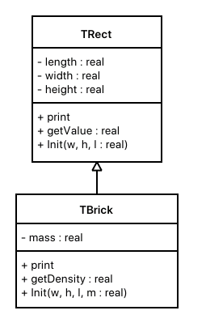
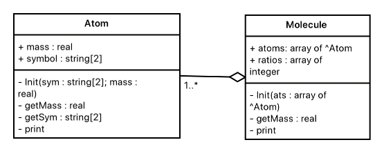

== Часть 1. Простые объекты
Описать объект, включающий заданные поля и методы. Написать программу, которая создает объект и тестирует его методы.

Объект – лифт. Поле: номер этажа, на котором в данный момент находится лифт. Методы: инициализирующая процедура, процедура перемещения лифта на заданный этаж и функция, возвращающая номер текущего этажа.

.Схема объекта

.Код реализации объекта "Лифт"
[source,pascal]
----
include::01.pas[]
----

== Часть 2. Наследование
Разработать и реализовать иерархию классов для описанных объектов предметной области, используя механизмы наследования.

Объект – прямоугольный параллелепипед. Параметры: длина, ширина, высота. Методы: процедура инициализации, процедура вывода параметров параллелепипеда на экран и функция определения объема параллелепипеда.

Объект – кирпич. Параметры: длина, ширина, высота, масса. Методы: процедура инициализации, процедура вывода параметров кирпича на экран и функция определения плотности кирпича.

.Схема объектов "Парралелипипед" и "Кирпич"

.Код реализации объектов
[source,pascal]
----
include::02.pas[]
----

== Часть 3. Композиция
Разработать и реализовать диаграмму классов для описанных объектов предметной области, используя механизмы композиции.

Объект – атом химического элемента. Поля: символьное обозначение химического элемента (например, Hg или S) и его относительная атомная масса. Методы: процедура инициализации, процедура вывода на экран информации об атоме и функции, возвращающие значения полей по запросу.

Объект – молекула химического вещества, состоящая из некоторого количества атомов. Методы объекта должны позволять: инициализировать молекулу, вывести на экран формулу химического вещества в виде Fe2O3, вычислить относительную молекулярную массу.

.Схема объектов "Молекула" и "Атом"

.Код реализации объектов
[source,pascal]
----
include::03.pas[]
----
