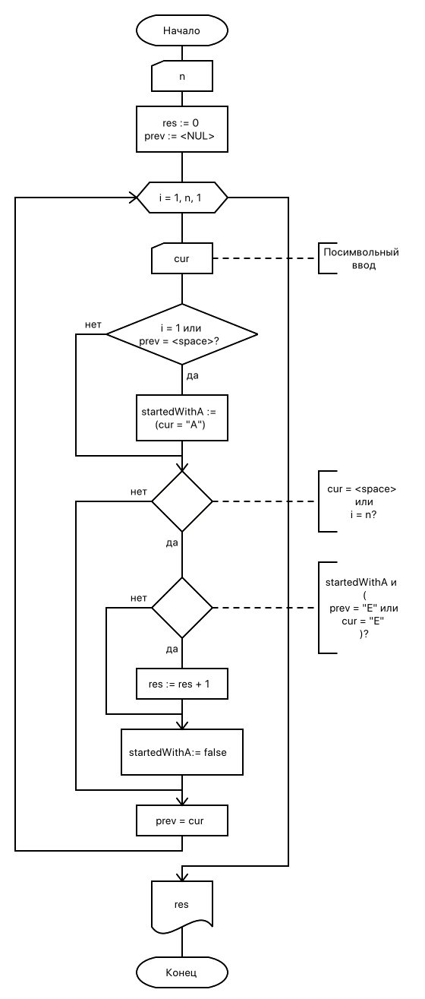

== Задача
Дано натуральное число n, латинские символы S1, S2, …, Sn, образующие строку. Группы символов, разделенных одним или несколькими пробелами и не содержащих пробелов внутри себя, назовем словами. Найти количество слов, начинающихся с буквы «A» и оканчивающиеся на «E».

[grid=no,frame=no,cols=2*]
|===
a|
.Схема алгоритма

a|
.Код решения
[source,pascal]
----
include::06.pas[]
----
|===

<<<

.Тестирование
[%header, cols=3*, grid=no, frame=no]
|===
|Вход |Результат |Ожидается

|10
AreiE AEE
|2
|2

|10
eeeeeeeee
|0
|0

|10
AiE   AiE
|2
|2
|===
