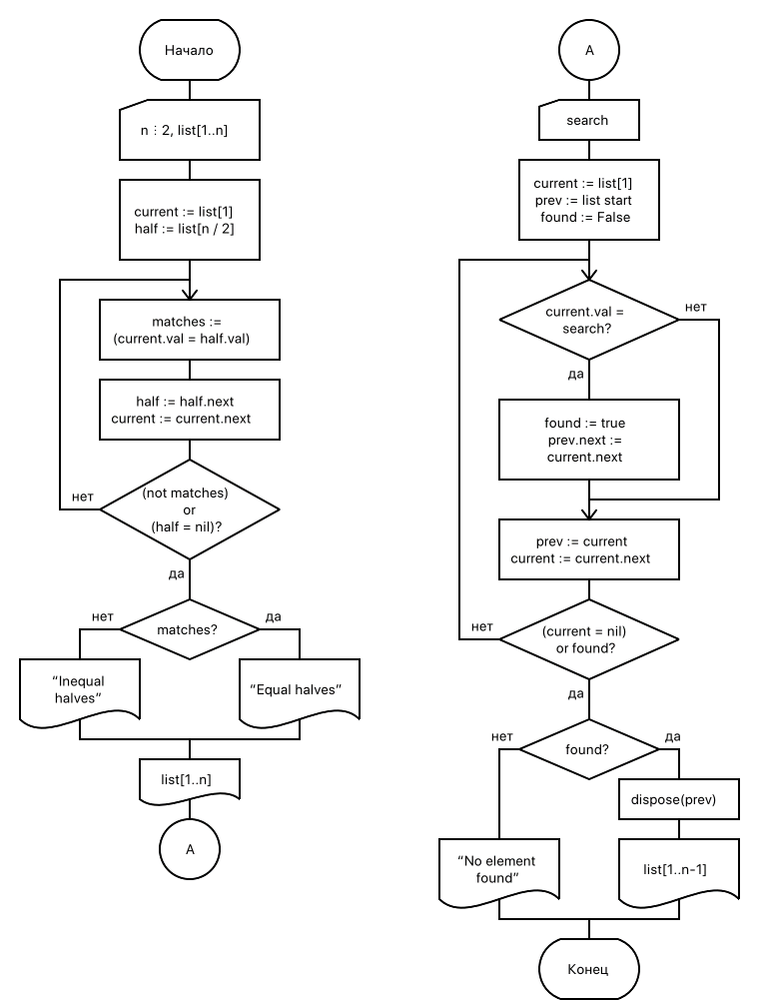

== Задание
С клавиатуры вводится последовательность, содержащая четное число символов. Составить из символов список. Определить, совпадают ли первая и вторая половины последовательности. Вывести на экран результат. Исключить из последовательности указанный символ. Вывести на экран исходный список и полученный список или сообщение об отсутствии введенного символа в списке.

.Тестирование
[%header,cols=3,frame=no]
|===
|Ввод |Результат |Ожидается

a|
----
8
12345678
8
----
a|
----
NOT equal
1234567
----
a|
----
NOT equal
1234567
----

a|
----
8
12341234
5
----
a|
----
equal
no item in list
----
a|
----
equal
no item in list
----
|===

== Вывод
Я научился работать с динамической памятью и динамическими структурами данных, в данном случае с односвязными списками

[grid=no,frame=no,cols=2]
|===
a|
.Начало программы
[source,pascal]
----
include::09.pas[tag=a]
----
_продолжение справа_

a|
.Схема алгоритма

.Конец программы
[source,pascal]
----
include::09.pas[tag=b]
----
|===
