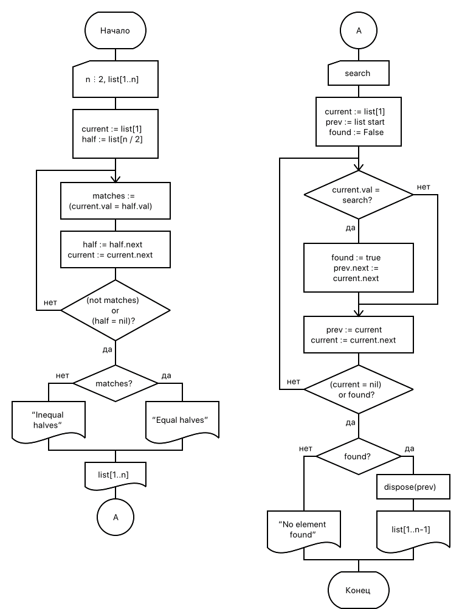

== Задание
С клавиатуры вводится последовательность, содержащая четное число символов. Составить из символов список. Определить, совпадают ли первая и вторая половины последовательности. Вывести на экран результат. Исключить из последовательности указанный символ. Вывести на экран исходный список и полученный список или сообщение об отсутствии введенного символа в списке.

.Схема алгоритма

.Код программы
[source,pascal]
----
inclde::09.pas[]
----

