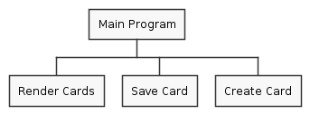
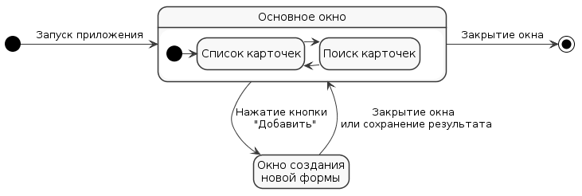
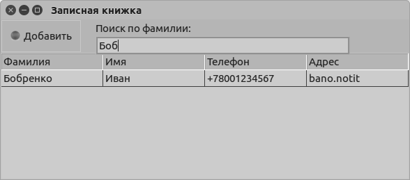
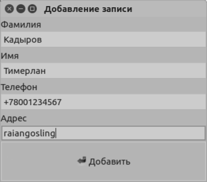

== Задача
Разработать приложение «Записная книжка».

== Схемы
.Объектная декомпозиция
image::objects.png[]

.Процедурная декомпозиция

.Состояния пользовательского интерфейса

== Снимки форм в разных состояниях

[cols=2*,grid=no,frame=no]
|===
a|
.Основное окно
image::screens/main.first.png[%autowidth]

.Основное окно в состоянии поиска

a|
.Окно добавления новой карточки

== Вывод
Я научился использовать событиейное программирование на примере создания графического приложения.
|===
