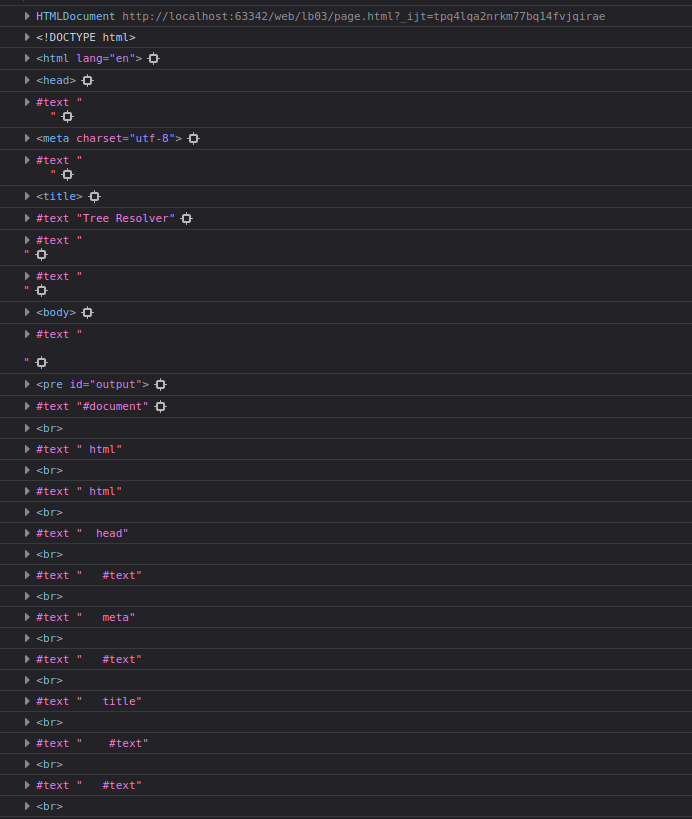

= ЛР3. Javascript. Обход дерева элементов страницы.

{author}

== Задание

Написать Javascript-код для вывода дерева элементов страницы, с которой этот код запущен.
Отступы для отображения формировать как символ `&nbsp;`

В процессе выполнения работы реализовать следующие пункты:

. Сформировать страницу с произвольным кодом разметки, но обеспечить уровень вложенности внутри элемента `<body>` не менее 3.

. добавить внутри элемента `<body>` секцию `
`, предназначенную для вывода результата обхода дерева элементов страницы.

. Выбрать способ активации рекурсивной программы обхода дерева элементов, реализовать и подключить эту программу.

. При проходе по узлам разметки обеспечить отладочный вывод в консоль.
Привести в отчете содержимое консоли.

. Реализовать вывод на странице.

В отчете привести код страницы с программой обхода, отладочный вывод в консоль и примеры обхода дерева элементов страницы.

== Решение

Скрипт обхода дерева элементов.

.resolver.js
[source,js]
----
include::resolver.js[]
----

Страница для примера.

.page.html
[source,html]
----
include::page.html[]
----

Результат обхода дерева:

.Вывод на страницу
[source]
----
#document
 html
 html
  head
   #text
   meta
   #text
   title
    #text
   #text
  #text
  body
   #text
   pre#output
    #text
    br
    #text
    br
    #text
    br
    #text
    br
    #text
    br
    #text
    br
    #text
    br
    #text
    br
    #text
    br
    #text
    br
    #text
    br
    #text
    br
    #text
    br
    #text
    br
   #text
   div#id1.test.another-test
    #text
    div#id2.tester
    #text
    input#id3
    #text
    p
     span
    #text
    #comment
    #text
   #text
   button
    #text
   #text
   script
   #text
----

.Отладочный вывод в консоль

