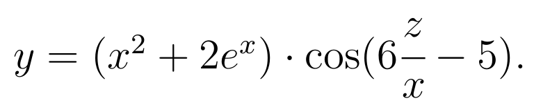

= Программы на Ruby без использования циклов for, while, loop. Обработка массивов
:lab: 5

== Часть 1
Вычислить: 

=== Решение

.logic.rb
[source,ruby]
----
include::p1/logic.rb[]
----

.cli.rb
[source,ruby]
----
include::p1/cli.rb[]
----

.test.rb
[source,ruby]
----
include::p1/test.rb[]
----

== Часть 2

Дана последовательность строк. Строки состоят из слов, разделенных пробелом. Каждая строка содержит существительные единственного числа, оканчивающиеся на «онок» и «енок». Написать программу,
обеспечивающую ввод строк и их корректировку. Корректировка заключается в преобразовании существительных в единственном числе, во мно-
жественное. Для преобразования считать, что множественное число этих
существительных образуется на другой основе по образцу:

Цыпленок – цыплята, мышонок – мышата. При этом, «а» перед «т»
пишется, если корень оканчивается на шипящую, а в остальных случаях
перед «т» будет буква «я».

Вывести на печать исходную и скорректированную последовательно-
сти строк.

Автоматический тест программы обязательно должен генерировать
случайные строки в соответствии с правилами, перечисленными в зада-
нии.

=== Решение

.logic.rb
[source,ruby]
----
include::p2/logic.rb[]
----

.cli.rb
[source,ruby]
----
include::p2/cli.rb[]
----

.test.rb
[source,ruby]
----
include::p2/test.rb[]
----
