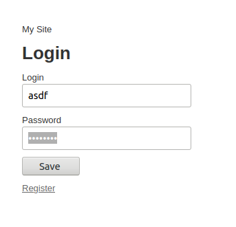
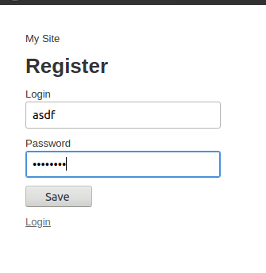
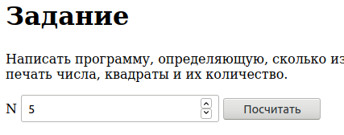
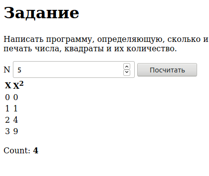

= Сессии. Выполнение авторизации. Интеграционные тесты
:lab: 12

include::docs/attributes-ru.adoc[]

Модифицировать код приложения ЛР 8 таким образом, чтобы вычисление было невозможно без регистрации пользователя и аутентификации при помощи логина/пароля.

- Сгенерировать при помощи генератора scaffold ресурс для регистрации пользователей.
- Создать БД и выполнить миграцию соответствующим запросом rake.
- Проверить возможность добавления, редактирования информации и получения списка пользователей.
- Удалить отображение поля пароля при просмотре списка пользователей.
- Добавить контроллер сессий.
- Реализовать форму для ввода логина/пароля при обращении по адресу /. Добавить ссылку на регистрацию нового пользователя. При успешном вводе логина/пароля должно осуществляться перенаправление на страницу ввода параметров для вычисления.
- Реализовать при помощи контроллера сессий во всех действиях контроллера проверку о того, прошел ли пользователь аутентификацию или нет (с выдачей соответствующей отладочной информации).
- Вставить фильтры для запроса аутентификации.
- Подготовить интеграционный тест, позволяющий проверить регистрацию нового пользователя, вход под его именем и выполнение вычислений.
- Подготовить интеграционный тест для проверки невозможности выполнения вычислений без ввода логина/пароля.
- Проверить маршруты приложения с помощью rake routes и убрать лишние. Обеспечить доступ при обращении по адресу /.

== Модель

.app/models/user.rb
[source,ruby]
----
include::app/models/user.rb[]
----

.db/migrate/20201130184755_create_users.rb
[source,ruby]
----
include::db/migrate/20201130184755_create_users.rb[]
----

.db/schema.rb
[source,ruby]
----
include::db/schema.rb[]
----

.test/models/user_test.rb
[source,ruby]
----
include::test/models/user_test.rb[]
----

.test/fixtures/users.yml
[source,yaml]
----
include::test/fixtures/users.yml[]
----

== Контроллер

.app/controllers/welcome_controller.rb
[source,ruby]
----
include::app/controllers/welcome_controller.rb[]
----

.test/controllers/welcome_controller_test.rb
[source,ruby]
----
include::test/controllers/welcome_controller_test.rb[]
----

.config/routes.rb
[source,ruby]
----
include::config/routes.rb[]
----

.app/controllers/application_controller.rb
[source,ruby]
----
include::app/controllers/application_controller.rb[]
----

.app/controllers/auth_controller.rb
[source,ruby]
----
include::app/controllers/auth_controller.rb[]
----

.app/controllers/users_controller.rb
[source,ruby]
----
include::app/controllers/users_controller.rb[]
----

.Gemfile
[source,ruby]
----
include::Gemfile[]
----

.test/controllers/auth_controller_test.rb
[source,ruby]
----
include::test/controllers/auth_controller_test.rb[]
----

.test/system/auth_test.rb
[source,ruby]
----
include::test/system/auth_test.rb[]
----

.test/test_helper.rb
[source,ruby]
----
include::test/test_helper.rb[]
----

== Представление

.app/views/auth/_form.html.erb
[source,erb]
----
include::app/views/auth/_form.html.erb[]
----

.app/views/auth/login.html.erb
[source,erb]
----
include::app/views/auth/login.html.erb[]
----

.app/views/auth/register.html.erb
[source,erb]
----
include::app/views/auth/register.html.erb[]
----

.Форма авторизации

.Форма регистрации

.Форма ввода данных

.Форма вывода данных

== Вывод
Были получены практические навыки реализации сессиией пользователей авторизации в приложениях на Ruby on Rails
