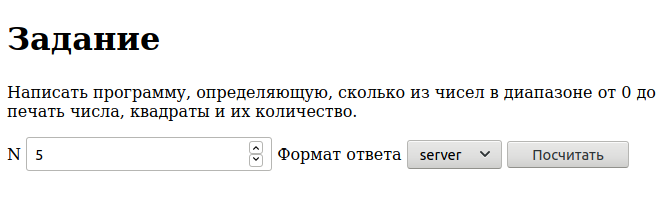
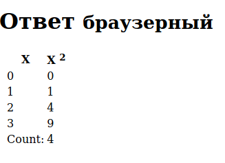
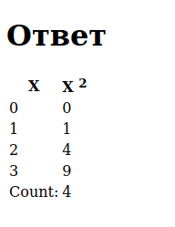
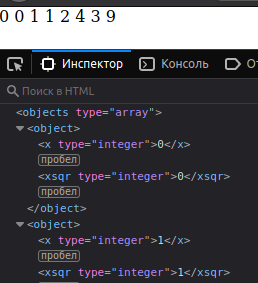

= Формирование и отображение XML в HTML средствами сервера и клиента
:lab: 10

include::rails-project/docs/attributes-ru.adoc[]

== Задание
Модифицировать код ЛР 8 таким образом, чтобы по запросу с указанными параметрами выдавался результат в формате XML (средствами стандартной сериализации ActiveSupport).

- Проверить формирование XML и сохранить в файл для отладки XSLT и второго приложения.
- Написать функциональный тест, проверяющий формат выдаваемых данных при запросе RSS.

Разработать XSLT-программу преобразования полученной XML в HTML.

Добавить в проверяемый XML-файл строку привязки к преобразованию `<?xml-stylesheet type="text/xsl" href="some_transformer.xslt"?>`. Проверить корректность отображения браузером результата преобразования.

Проверить на автономной Ruby-программе корректность преобразования, используя следующий фрагмент кода:

[source,ruby]
----
require 'nokogiri'
doc = Nokogiri::XML(File.read('some_file.xml'))
xslt = Nokogiri::XSLT(File.read('some_transformer.xslt'))
puts xslt.transform(doc)
----

Разработать второе приложение, являющееся посредником между клиентом и первым приложением, задачей которого является преобразование XML в HTML или передача в неизменном виде браузеру для отображения браузером. Приложение должно запускаться с указанием номера порта TCP, отличным от номера порта первого приложения (например `rails server -p 3001`)!

- Подготовить каркас приложения, а также форму формирования запроса, форму отображения результата и соответствующие действия контролера.

- Добавить в контроллер преобразование XML в HTML с помощью ранее разработанного XSLT-файла.

- Подключить запрос XML с первого приложения и проверить работу приложений в связке.

- Написать функциональный тест, проверяющий что при различных входных данных результат генерируемой страницы различен.

- Доработать код контроллера и представлений данного приложения для выдачи браузеру XML-потока в неизменном виде (организовать возможность выбора формата выдачи для пользователя).

- Проверить, что браузер получает XML первого приложения в неизменном виде.

- Доработать код контроллера приложения таким образом, чтобы XML-поток первого приложения получал дополнительную строку, указывающую xsl. Модифицировать форму запроса параметров таким образом, чтобы браузер получал в ответ XML. При этом разместить XSLT-файл в директории public.

- Проверить, что браузер производит преобразование XML->HTML в соответствии с xlt.

- Реализовать функциональные тесты второго приложения. Проверить результаты, формируемые приложением, на соответствие выбранному формату выдачи.

Итоговая форма ввода параметра должна содержать кнопки или селектор, позволяющие проверить два варианта преобразования:

- Серверное xml+xslt->html

- Клиентское xml+xslt->html

== Результат

Получилось 2 приложения: rails_project и xmlproxy.

=== rails_project

Так как приложение не отличается от 8 и 9 лабораторной работы, приводится только изменившийся контроллер:

.rails-project/app/controllers/welcome_controller.rb
[source,ruby]
----
include::rails-project/app/controllers/welcome_controller.rb[]
----

.rails-project/test/controllers/welcome_controller_test.rb
[source,ruby]
----
include::rails-project/test/controllers/welcome_controller_test.rb[]
----

=== XMLProxy

.xmlproxy/app/controllers/proxy_controller.rb
[source,ruby]
----
include::xmlproxy/app/controllers/proxy_controller.rb[]
----

.xmlproxy/app/views/proxy/output.html.erb
[source,erb]
----
include::xmlproxy/app/views/proxy/output.html.erb[]
----

.xmlproxy/app/views/proxy/index.html.erb
[source,erb]
----
include::xmlproxy/app/views/proxy/index.html.erb[]
----

.xmlproxy/test/controllers/proxy_controller_test.rb
[source,ruby]
----
include::xmlproxy/test/controllers/proxy_controller_test.rb[]
----

.xmlproxy/public/browser_transform.xslt
[source,xml]
----
include::xmlproxy/public/browser_transform.xslt[]
----

.xmlproxy/public/server_transform.xslt
[source,xml]
----
include::xmlproxy/public/server_transform.xslt[]
----

.Форма ввода

.Форма вывода браузера

.Форма вывода сервера

.Вывод xml

== Вывод

Были получены навыки работы с XML, XSLT, проксирования запросов.
