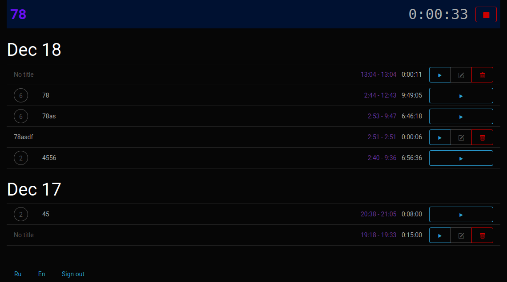

= Trackr ― приложение для отслеживания времени

include::docs/attributes-ru.adoc[]

== Задание

Основная задача зачётной работы - продемонстрировать полученные знания в создании собственного веб-приложения. Тему зачётной работы допустимо выбрать самостоятельно, но обязательно согласовать с преподавателем.

Обязательные требования к программе:

- Для реализации использовать Ruby on Rails.
- Необходимо иметь контроллеры, обеспечивающие обработку запросов.
- Необходимо использовать модели для хранения данных в БД.
- Необходимо обеспечить аутентификацию пользователей.
- При реализации клиентской части необходимо применить код на языке Javascript и таблицы стилей CSS. 
- Провести интернационализацию приложения и обеспечить вывод надписей на русском языке (см. пример в лекции 11).

== Цель работы
Показать практические знания создания веб-приложений. Показать умение работать с JavaScript, CSS, Ruby on Rails, базой данных.

== Функционал приложения

Trackr -- аналог сервиса https://track.toggl.com[Track Toggl].

Основной функционал:

. Хранение данных о потраченом времени
. Удобная группировка потраченного времени
. Возможность продолжить незавершённую работу

== Интерфейс

.Общий экран

.Группировка

.Английская версия сайта

[cols=2,frame=no,grid=no]
|===
a|
.Авторизация

a|
.Регистрация

|===
.Изменение данных

//== Код
//
//:leveloffset: +1

== Используемые пакеты

.Gemfile
[source,ruby]
----
include::Gemfile[]
----

.package.json
[source,json]
----
include::package.json[]
----

== Модели и миграции

.app/models/time_entry.rb
[source,ruby]
----
include::app/models/time_entry.rb[]
----

.app/models/user.rb
[source,ruby]
----
include::app/models/user.rb[]
----

.db/migrate/20201201195057_devise_create_users.rb
[source,ruby]
----
include::db/migrate/20201201195057_devise_create_users.rb[]
----

.db/migrate/20201217190440_create_time_entries.rb
[source,ruby]
----
include::db/migrate/20201217190440_create_time_entries.rb[]
----

== Контроллеры

.app/controllers/application_controller.rb
[source,ruby]
----
include::app/controllers/application_controller.rb[]
----

.app/controllers/time_entries_controller.rb
[source,ruby]
----
include::app/controllers/time_entries_controller.rb[]
----

== Вёрстка и представления

.app/assets/stylesheets/time_entries.scss
[source,scss]
----
include::app/assets/stylesheets/time_entries.scss[]
----

.app/views/layouts/application.html.erb
[source,erb]
----
include::app/views/layouts/application.html.erb[]
----

.app/views/time_entries/_entry.html.erb
[source,erb]
----
include::app/views/time_entries/_entry.html.erb[]
----

.app/views/time_entries/_form.html.erb
[source,erb]
----
include::app/views/time_entries/_form.html.erb[]
----

.app/views/time_entries/_new_form.html.erb
[source,erb]
----
include::app/views/time_entries/_new_form.html.erb[]
----

.app/views/time_entries/edit.html.erb
[source,erb]
----
include::app/views/time_entries/edit.html.erb[]
----

.app/views/time_entries/index.html.erb
[source,erb]
----
include::app/views/time_entries/index.html.erb[]
----

.app/views/time_entries/new.html.erb
[source,erb]
----
include::app/views/time_entries/new.html.erb[]
----

.app/views/time_entries/show.html.erb
[source,erb]
----
include::app/views/time_entries/show.html.erb[]
----

.app/views/time_entries/_time_entry.json.jbuilder
[source,ruby]
----
include::app/views/time_entries/_time_entry.json.jbuilder[]
----

.app/views/time_entries/index.json.jbuilder
[source,ruby]
----
include::app/views/time_entries/index.json.jbuilder[]
----

.app/views/time_entries/show.json.jbuilder
[source,ruby]
----
include::app/views/time_entries/show.json.jbuilder[]
----

== JavaScript

.app/javascript/EntryEditor.js
[source,javascript]
----
include::app/javascript/EntryEditor.js[]
----

.app/javascript/packs/application.js
[source,javascript]
----
include::app/javascript/packs/application.js[]
----

.app/javascript/packs/timetracker.js
[source,javascript]
----
include::app/javascript/packs/timetracker.js[]
----

== Конфигурация и локализация

.config/application.rb
[source,ruby]
----
include::config/application.rb[]
----

.config/locales/en.yml
[source,yaml]
----
include::config/locales/en.yml[]
----

.config/locales/ru.yml
[source,yaml]
----
include::config/locales/ru.yml[]
----

.config/routes.rb
[source,ruby]
----
include::config/routes.rb[]
----

== Тестирование

.test/controllers/time_entries_controller_test.rb
[source,ruby]
----
include::test/controllers/time_entries_controller_test.rb[]
----

.test/fixtures/time_entries.yml
[source,yaml]
----
include::test/fixtures/time_entries.yml[]
----

.test/fixtures/users.yml
[source,yaml]
----
include::test/fixtures/users.yml[]
----

.test/system/time_entries_integration_test.rb
[source,ruby]
----
include::test/system/time_entries_integration_test.rb[]
----

== Вывод

В результате работы получилось веб-приложение, в котором используется JavaScript для реализации функциональности в браузере, CSS для стилизации, Ruby on Rails для реализации функцинала приложения в качестве бекэнда.
